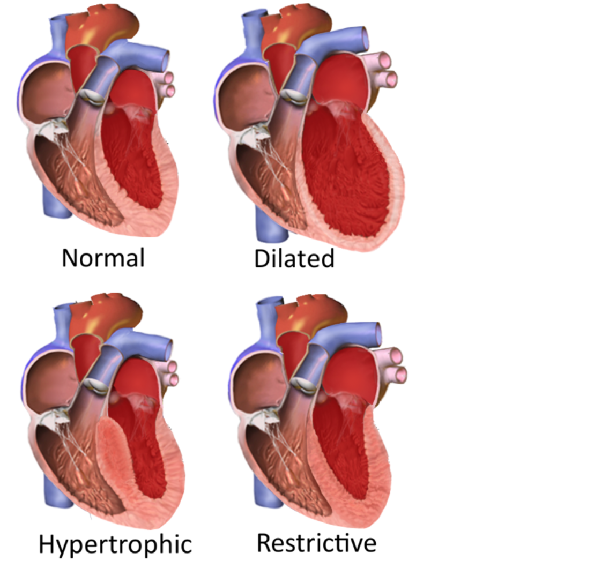
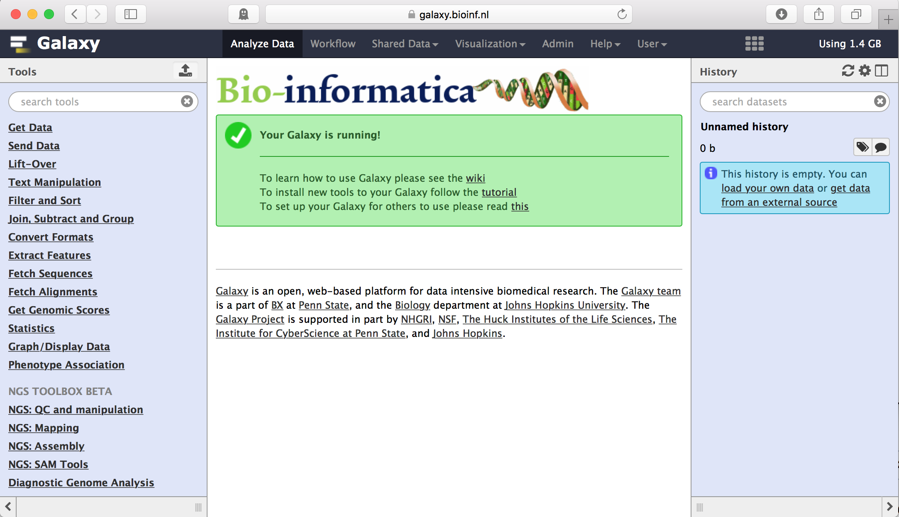

# Intro *NGS and Genetics* Project {#intro}

In this project you will learn the bioinformatic basics of how to analyse *Next-Generation Sequence* (NGS) data of patients diagnosed with either [cardiomyopathy](https://en.wikipedia.org/wiki/Cardiomyopathy) or [Medulloblastoma](https://en.wikipedia.org/wiki/Medulloblastoma). Using this case we will discover genetic variations present in the genomic data of a patient having a suspected condition. The end-goal is to identify and report on those genomic variations that are possibly disease causing. All course material can be found in this document, some theory, a *lot* of links to resources, questions and assignments.

## Cardiomyopathy

```{r, echo=FALSE}

```

As with many diseases, one of the causes of cardiomyopathy are a combination of genetic mutation(s). According to Wikipedia, the following forms of cardiomyopaty have a genetic base:

-   **Hypertrophic** cardiomyopathy
-   Arrhythmogenic right ventricular cardiomyopathy (ARVC)
-   LV non-compaction
-   Ion Channelopathies
-   **Dilated** cardiomyopathy (DCM)
-   **Restrictive** cardiomyopathy (RCM)

The human genetics department of the University Medical Center Groningen diagnoses patients suspected to suffer from cardiomyopathy. As part of the diagnosis, the patients genome is compared to a set of reference genes known to be involved in the disease (called a *gene panel*). If variations are found they are checked and compared to known variants to classify or score their *severity*. Using these variations the type (dilated, restrictive, etc.) of the disease and how severe it is can be diagnosed, combined with regular data sources (physical exam, EKG, etc.).

## Medulloblastoma

Medulloblastoma is a type of brain cancer that occurs most often in children and is also the most common type of cancer in children. The cancer starts in the lower back part of the brain, called the cerebellum. The cerebellum is involved in muscle coordination, balance, and movement. It is a type of embryonal tumor, which means it starts in the fetal (embryonic) cells in the brain. The cancer cells are immature and often look like embryonic cells under a microscope. The cancer can spread to other areas of the brain and spinal cord. The cause of medulloblastoma is not known. It is not caused by head injury or exposure to radiation. It is not passed down through families. The cancer is more common in children with a weakened immune system and certain genetic problems, such as Gorlin syndrome or Turcot syndrome.

The article accompanying the available data set specifies that there are multiple subtypes. **This project aims to identify the subtypes of the available samples**.

> "Traditionally, MB has been stratified into four histopathological subtypes based on histological appearance: Classic, Large Cell/Anaplastic, Desmoplastic/Nodular (DNMB) and MB with Extensive Nodularity (MBEN)3,4. Additionally, in the last decade, four molecular groups (WNT, SHH, Group 3, and Group 4) together with various subgroups have been defined and now generally replace the classic histopathological stratification in the 2021 WHO classification of central nervous system (CNS) tumors"

-   Article: "*Compartments in medulloblastoma with extensive nodularity are connected through differentiation along the granular precursor lineage*"; <https://www.nature.com/articles/s41467-023-44117-x>
-   Data set: <https://www.ncbi.nlm.nih.gov/biosample?LinkName=bioproject_biosample_all&from_uid=1044021>
-   Data acquisition: "Libraries were enriched by hybrid capture with custom biotinylated RNA oligo pools covering exons of 130 cancer-associated genes. Paired-end sequencing was performed using the NextSeq 500 (Illumina)."
-   Gene panels (all listed genes are included in the BED-file available in Galaxy):
    1.  <https://www.ncbi.nlm.nih.gov/gtr/tests/607978/>
    2.  <https://www.preventiongenetics.com/testInfo?val=Medulloblastoma-Panel>
    3.  <https://repositorium.sdum.uminho.pt/bitstream/1822/57968/1/Leal_et_al-2018-Neuropathology.pdf>

Note that the article specifies 130 cancer-associated genes but does *not* refer to this list. The links above add up to 122 genes in total for genes related to (multiple types of) cancer. Subsequent data analysis will have to be performed to identify the genes that are actually captured for the exome sequencing.

## Tools

In this project we will work with many different software tools to replicate the genetic diagnoses process, both available either for download or on the computer you are now using. Other tools we are going to create ourselves! All of these tools however perform important steps in the analysis process and involve:

-   checking the quality of input data,
-   mapping the data to a reference genome (comparing with 'known' data),
-   finding variations in respect to the reference and
-   scoring the found variations on the probability that they are disease causing.

Normally these steps involve many separate tools which need to be run as a terminal application, however for this course we will be using a [*worflow manager*](https://en.wikipedia.org/wiki/Scientific_workflow_system) in which most of the tools are available and can be joined together to form logical steps in the analysis process. The workflow manager used in this course is **Galaxy** ([wikipedia](https://en.wikipedia.org/wiki/Galaxy_(computational_biology)), [website](http://galaxyproject.org/)), but other worflow managers exist such as: [CLC Bio](https://www.qiagenbioinformatics.com/products/clc-main-workbench/), [Taverna](http://www.taverna.org.uk), [Nextgene](http://www.softgenetics.com/NextGENe.php) or [SnakeMake](https://snakemake.readthedocs.io/en/stable/). It is very likely that you will encounter one of these workflow managers in your future professional career, as many scientific laboratories do their biomedical research with the help of tools organised in such workflow managers.

Next to the advantage of coupling multiple tools together into a *workflow*, Galaxy is the ideal translation from often hard-to-use *commandline tools* to easy-to-use by a large audience by offering simple *graphical interfaces*.

Actually one of the reasons that you are following this course is to become proficient in also using these commandline tools and combining them into a workflow (also called a pipeline) so that non-technical researchers can use them!

**Week 1** of this course starts by explaining what Galaxy is and how you can use it to analyze your data, but first we will introduce and discuss the data we will be working with.

## Data

As a bioinformatician we often do not *create* the data we analyze ourselves but these come from a lab which - for this project - has a **sequencer**. This sequencer (an Illumina Miseq or NextSeq [youtube](https://youtu.be/womKfikWlxM), many other sequencing technologies exist and you will learn about these in a seperate lecture) generates sequencing data from a biological sample. Sequencing data for the cases introduced in this module will come from genome data. In a different module (2.1.2), you will also learn to work with transcriptomics data (RNA).

The first step in performing a so called *sequencing run* is the sample-preparation. For this project this fase is used to *filter* the isolated DNA so that only the exons of the genes of interest (consisting of one or more **exons** or EXpressed regiONs) are kept, this method is called [*exome sequencing*](https://en.wikipedia.org/wiki/Exome_sequencing).

```{r, echo=FALSE, out.width="100%"}
knitr::include_graphics("images/exons.png")
```

By targeting specific genes (called a gene panel) we omit the bulk of the genome, and this has an important consequence. The human genome contains 26.564 genes that have 233.785 exons combined (when looking at the human genome build 2003). We can get more data on selectively targeting genes of interest, instead of trying to read the whole exome. Can you think of a reason that this is true?

All DNA not included in the genes of interest and thus also the introns (somewhere around **98%** of all DNA) is not sequenced, therefore from the total of \~3.2 billion basepairs only a small fraction is actually sequenced. This greatly depends on the case you selected and the number of genes present in the gene panel, but will typically be a very small percentage usually less than 1% of the genome.

The actual data that we will be using is stored in relatively simple text-files containing the sequenced letters (A, C, G and T) along with some data primarily used to describe the quality of each sequenced base. Given the sequencing technology used to generate the sequencing data, we are limited to the machine's technical capabilities to generate such data. In case of the MiSeq or NextSeq, this means that - unfortunately - not very long continuous sequences can be produced. The files generated by such sequencers contain *millions* of short sequences (\~150 basepairs each, called a sequence **read**) with no particular order.

The challenge with using this data to answer our initial question (which specific variations (mutations) are responsible for acquiring this disease) is to find out *where* each of these sequences originate from so that we can compare the patients' sequence to the sequence of a healthy individual. With this comparison we can find if and where any variation is and thus begin with answering our question.

## Analysis

This course consists of a number of chapters like this that can be worked through in-order. The first section of each of these documents shows where in the analysis you are and which steps are next. It also shows what tools you are going to use and if there are any assignments included.

You will note that this document for the first week is not very long nor does it contain too many assignments. This is on purpose since the goal of this week is primarily for you to understand:

-   what the goal of this course is
    -   what is the disease you are looking into?
    -   what question(s) do we want to answer?
-   the tools we will be using
    -   what is this Galaxy website? *follow a tutorial to get familiar with it*
    -   what kind of tools are available in Galaxy?
-   the data which we will use throughout this course
    -   how is this data generated?
-   which analysis steps are needed to answer our research question?

::: rmdnote
**Note on the assignments**:

If you are good at scanning documents you can easily spot the actual assignments in the first chapter and complete them in under two hours (note; this is not a challenge!). However, if I were to ask you to answer or explain some of the above questions you will probably have a hard time. To summarize, make sure that the general theory of what is shown here is clear at the end of this chapter.

Either follow all the links to external resources, use google or (and this works pretty well) search for some of the terms or techniques on YouTube. Without this knowledge, you will manage to follow the steps during the first few weeks but will surely struggle later on when you need to make decisions on your own. Your final grade is not based on how you complete your assignments, but also on the level of understanding that you show in your lab journal and during the presentation.
:::

We begin the practical of each new week by first having a group discussing on what we did in the previous week.

## Literature

There is no explicit book for the case or other text that you will need to read, but there is a lot of online material available to use when you encounter unknown terms or concepts. The article titled '[Review of Current Methods, Applications, and Data Management for the Bioinformatics Analysis of Whole Exome Sequencing](https://www.ncbi.nlm.nih.gov/pmc/articles/PMC4179624/)' discusses the complete process of analyzing raw sequencing data for variant analysis and while it goes beyond the scope of this project it is a good read.

Besides this practical, the lectures from the Theory of Bioinformatics module also greatly add to your understanding of both the techniques, data and challenges we need to solve.

## Reporting

To help you work trough these document and prepare you as best as possible for the final presentation it is best to keep track of all your analysis steps and findings.

As you will already have learned during the "Wetenschappelijke Cyclus" module, a type of document called [R Markdown](https://rmarkdown.rstudio.com) is very suitable for this purpose. In this document you can write a combination of text and code where the results (be it tables or figures) are included as well. Therefore, it is very suitable as a lab-journal for this course.

There are no imposed rules on how to report your progress since it is not comparable with a normal written report (no chapters called 'introduction', 'results', etc.), just try to keep it organized, clearly state what you are doing and why this is important and where your results belong to. Do note however that when you use figures and tables (please do!), provide them with a clear caption to explain what you are showing. The logfile is not part of the grading (in the next module it will be!), here it is just a convenient way to keep track of all steps and results.

### Galaxy Server

This is the main 'tool' (or (web)platform) containing the *actual* tools for performing our analysis we will use during this course. Since we are spending a lot of time in Galaxy we start by learning how to use it. Note that there are a lot of Galaxy servers available to use worldwide and each server probably contains a different set of implemented tools. Typically, different labs have their own Galaxy server and host just the tool that are important for that particular lab to run their analyses. The main galaxy server is available at <https://usegalaxy.org> which is fine for learning about galaxy (section below) but **won't** be used later on (see the section below that) and you do **not** have to register on that server.

#### Learning Galaxy {.unnumbered}

Start by following a beginner *tutorial* available at the [Galaxy Training](https://galaxyproject.github.io/training-material/) collection or from the - old - [Galaxy Learn](https://wiki.galaxyproject.org/Learn) wiki page. First, browse the page to see what is available (some can be used later on too) and choose an interesting (beginners!) tutorial to try. While not all tutorials are either relevant or very up-to-date, you need to learn at least the following concepts:

-   Creating a new history or rename your current - empty - history
-   Uploading data from a local file
-   Finding/ selecting a tool
    -   Selecting the input data for a tool
    -   changing settings for a tool
    -   Executing a tool
-   Using the History to
    -   View tool-output
    -   Re-run a tool
    -   Delete elements
    -   Select and copy elements to a new history
-   And - preferably - something about creating a workflow
    -   This item will be explained later on too

You only need to report *which* tutorial you followed/ video tutorial you watched.

#### Bioinformatics Galaxy Server {.unnumbered}

After completing this tutorial, we switch to the Galaxy server that we will use throughout this course which is available at: <https://galaxy.bioinf.nl> and contains a collection of course specific tools.

```{r, echo=FALSE, out.width="100%"}

```

The Galaxy server that we host ourselves is different from the one that you've used for the tutorial. Different in this sense means containing a different collection of available software tools. Most of the tools that we will be using in this course can be found using the `search tools` input field, which can be found at the top left corner of Galaxy.

Some tools however were installed in bundles and have their own category and therefore the easiest method of finding the tool you need is to simply enter the name in the *search tools* field in the top-left corner.
