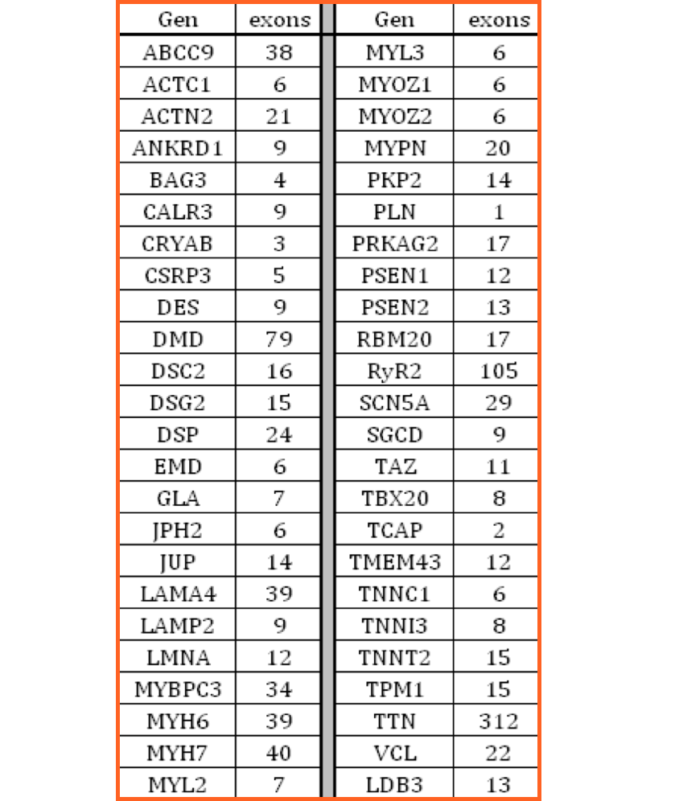
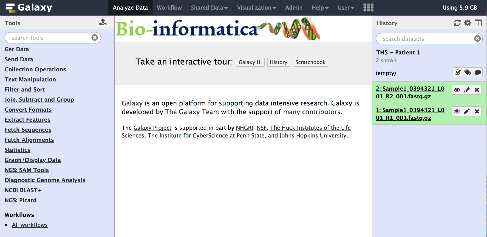
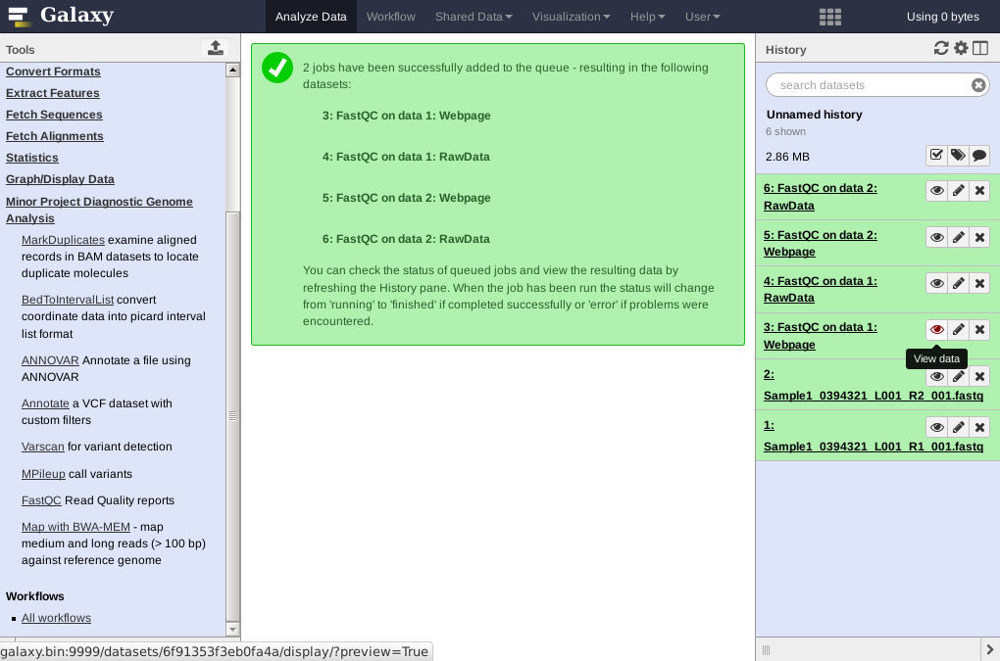
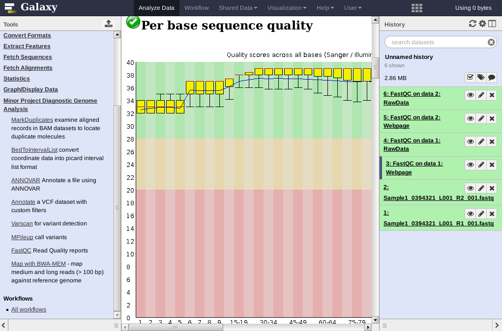

# Intro *NGS and Genetics* Project {#intro}

In this project you will learn the bioinformatic basics of how to analyse *Next-Generation Sequence* (NGS) data of patients diagnosed with either [cardiomyopathy](https://en.wikipedia.org/wiki/Cardiomyopathy) or [Medulloblastoma](https://en.wikipedia.org/wiki/Medulloblastoma). Using this case we will discover genetic variations present in the genomic data of a patient having a suspected condition. The end-goal is to identify and report on those genomic variations that are possibly disease causing. All course material can be found in this document, some theory, a *lot* of links to resources, questions and assignments.

## Cardiomyopathy

```{r, echo=FALSE}
knitr::include_graphics("images/cardiomyopathy.png")
```

As with many diseases, one of the causes of cardiomyopathy are a combination of genetic mutation(s). According to Wikipedia, the following forms of cardiomyopaty have a genetic base:

-   **Hypertrophic** cardiomyopathy
-   Arrhythmogenic right ventricular cardiomyopathy (ARVC)
-   LV non-compaction
-   Ion Channelopathies
-   **Dilated** cardiomyopathy (DCM)
-   **Restrictive** cardiomyopathy (RCM)

The human genetics department of the University Medical Center Groningen diagnoses patients suspected to suffer from cardiomyopathy. As part of the diagnosis, the patients genome is compared to a set of reference genes known to be involved in the disease (called a *gene panel*). If variations are found they are checked and compared to known variants to classify or score their *severity*. Using these variations the type (dilated, restrictive, etc.) of the disease and how severe it is can be diagnosed, combined with regular data sources (physical exam, EKG, etc.).

## Medulloblastoma

Medulloblastoma is a type of brain cancer that occurs most often in children and is also the most common type of cancer in children. The cancer starts in the lower back part of the brain, called the cerebellum. The cerebellum is involved in muscle coordination, balance, and movement. It is a type of embryonal tumor, which means it starts in the fetal (embryonic) cells in the brain. The cancer cells are immature and often look like embryonic cells under a microscope. The cancer can spread to other areas of the brain and spinal cord. The cause of medulloblastoma is not known. It is not caused by head injury or exposure to radiation. It is not passed down through families. The cancer is more common in children with a weakened immune system and certain genetic problems, such as Gorlin syndrome or Turcot syndrome.

The article accompanying the available data set specifies that there are multiple subtypes. This project aims to identify the subtypes of the available samples.

> "Traditionally, MB has been stratified into four histopathological subtypes based on histological appearance: Classic, Large Cell/Anaplastic, Desmoplastic/Nodular (DNMB) and MB with Extensive Nodularity (MBEN)3,4. Additionally, in the last decade, four molecular groups (WNT, SHH, Group 3, and Group 4) together with various subgroups have been defined and now generally replace the classic histopathological stratification in the 2021 WHO classification of central nervous system (CNS) tumors"

-   Article: "*Compartments in medulloblastoma with extensive nodularity are connected through differentiation along the granular precursor lineage*"; <https://www.nature.com/articles/s41467-023-44117-x>
-   Data set: <https://www.ncbi.nlm.nih.gov/biosample?LinkName=bioproject_biosample_all&from_uid=1044021>
-   Data acquisition: "Libraries were enriched by hybrid capture with custom biotinylated RNA oligo pools covering exons of 130 cancer-associated genes. Paired-end sequencing was performed using the NextSeq 500 (Illumina)."
-   Gene panels (all listed genes are included in the BED-file available in Galaxy):
    1.  <https://www.ncbi.nlm.nih.gov/gtr/tests/607978/>
    2.  <https://www.preventiongenetics.com/testInfo?val=Medulloblastoma-Panel>
    3.  <https://repositorium.sdum.uminho.pt/bitstream/1822/57968/1/Leal_et_al-2018-Neuropathology.pdf>

Note that the article specifies 130 cancer-associated genes but does *not* refer to this list. The links above add up to 122 genes in total for genes related to (multiple types of) cancer. Subsequent data analysis will have to be performed to identify the genes that are actually captured for the exome sequencing.

## Tools

In this project we will work with many different software tools to replicate the genetic diagnoses process, both available either for download or on the computer you are now using. Other tools we are going to create ourselves! All of these tools however perform important steps in the analysis process and involve:

-   checking the quality of input data,
-   mapping the data to a reference genome (comparing with 'known' data),
-   finding variations in respect to the reference and
-   scoring the found variations on the probabilty that they are disease causing.

Normally these steps involve many seperate tools which need to be run on the commandline, however for this course we will be using a [*worflow manager*](https://en.wikipedia.org/wiki/Scientific_workflow_system) in which most of the tools are available and can be joined together to form logical steps in the analysis process. The workflow manager used in this course is **Galaxy** ([wikipedia](https://en.wikipedia.org/wiki/Galaxy_(computational_biology)), [website](http://galaxyproject.org/)), but other worflow managers exist such as: [CLC Bio](https://www.qiagenbioinformatics.com/products/clc-main-workbench/), [Taverna](http://www.taverna.org.uk), [Nextgene](http://www.softgenetics.com/NextGENe.php) or [SnakeMake](https://snakemake.readthedocs.io/en/stable/). It is very likely that you will encounter one of these workflow managers in your future professional carreer, as many scientific laboratories do their biomedical research with the help of tools organised in such workflow managers.

Next to the advantage of coupling multiple tools together into a *workflow*, Galaxy is the ideal translation from often hard-to-use *commandline tools* to easy-to-use by a large audience by offering simple *graphical interfaces*.

Actually one of the reasons that you are following this course is to become proficient in also using these commandline tools and combining them into a workflow (also called a pipeline) so that non-technical researchers can use them!

**Week 1** of this course starts by explaining what Galaxy is and how you can use it to analyze your data, but first we will introduce and discuss the data we will be working with.

## Data

As a bioinformatician we often do not *create* the data we analyze ourselves but these come from a lab which - for this project - has a **sequencer**. This sequencer (an Illumina Miseq or NextSeq [youtube](https://youtu.be/womKfikWlxM), many other sequencing technologies exist and you will learn about these in a seperate lecture) generates sequencing data from a biological sample. Sequencing data for the cases introduced in this module will come from genome data. In a different module (2.1.2), you will also learn to work with transcriptomics data (RNA).

The first step in performing a so called *sequencing run* is the sample-preparation. For this project this fase is used to *filter* the isolated DNA so that only the exons of the genes of interest (consisting of one or more **exons** or EXpressed regiONs) are kept, this method is called [*exome sequencing*](https://en.wikipedia.org/wiki/Exome_sequencing).

```{r, echo=FALSE, out.width="100%"}
knitr::include_graphics("images/exons.png")
```

By targeting specific genes (called a gene panel) we omit the bulk of the genome, and this has an important consequence. The human genome contains 26.564 genes that have 233.785 exons combined (when looking at the human genome build 2003). We can get more data on selectively targeting genes of interest, instead of trying to read the whole exome. Can you think of a reason that this is true?

All DNA not included in the genes of interest and thus also the introns (somewhere around **98%** of all DNA) is not sequenced, therefore from the total of \~3.2 billion basepairs only a small fraction is actually sequenced. This greatly depends on the case you selected and the number of genes present in the gene panel, but will typically be a very small percentage usually less than 1% of the genome.

The actual data that we will be using is stored in relatively simple text-files containing the sequenced letters (A, C, G and T) along with some data primarily used to describe the quality of each sequenced base. Given the sequencing technology used to generate the sequencing data, we are limited to the machine's technical capabilities to generate such data. In case of the MiSeq or NextSeq, this means that - unfortunately - not very long continuous sequences can be produced. The files generated by such sequencers contain *millions* of short sequences (\~150 basepairs each, called a sequence **read**) with no particular order.

The challenge with using this data to answer our initial question (which specific variations (mutations) are responsible for acquiring this disease) is to find out *where* each of these sequences originate from so that we can compare the patients' sequence to the sequence of a healthy individual. With this comparison we can find if and where any variation is and thus begin with answering our question.

## Analysis

This course consists of a number of chapters like this that can be worked through in-order. The first section of each of these documents shows where in the analysis you are and which steps are next. It also shows what tools you are going to use and if there are any assignments included.

You will note that this document for the first week is not very long nor does it contain too many assignments. This is on purpose since the goal of this week is primarily for you to understand:

-   what the goal of this course is
    -   what is the disease you are looking into?
    -   what question(s) do we want to answer?
-   the tools we will be using
    -   what is this Galaxy website? *follow a tutorial to get familiar with it*
    -   what kind of tools are available in Galaxy?
-   the data which we will use throughout this course
    -   how is this data generated?
-   which analysis steps are needed to answer our research question?

::: rmdnote
**Note on the assignments**:

If you are good at scanning documents you can easily spot the actual assignments in the first chapter and complete them in under two hours (note; this is not a challenge!). However, if I were to ask you to answer or explain some of the above questions you will probably have a hard time. To summarize, make sure that the general theory of what is shown here is clear at the end of this chapter.

Either follow all the links to external resources, use google or (and this works pretty well) search for some of the terms or techniques on YouTube. Without this knowledge, you will manage to follow the steps during the first few weeks but will surely struggle later on when you need to make decisions on your own. Your final grade is not based on how you complete your assignments, but also on the level of understanding that you show in your lab journal and during the presentation.
:::

We begin the practical of each new week by first having a group discussing on what we did in the previous week.

## Literature

There is no explicit book for the case or other text that you will need to read, but there is a lot of online material available to use when you encounter unknown terms or concepts. The article titled '[Review of Current Methods, Applications, and Data Management for the Bioinformatics Analysis of Whole Exome Sequencing](https://www.ncbi.nlm.nih.gov/pmc/articles/PMC4179624/)' discusses the complete process of analyzing raw sequencing data for variant analysis and while it goes beyond the scope of this project it is a good read.

Besides this practical, the lectures from the Theory of Bioinformatics module also greatly add to your understanding of both the techniques, data and challenges we need to solve.

## Reporting

To help you work trough these document and prepare you as best as possible for the final presentation it is best to keep track of all your analysis steps and findings.

As you will already have learned during the "Wetenschappelijke Cyclus" module, a type of document called [R Markdown](https://rmarkdown.rstudio.com) is very suitable for this purpose. In this document you can write a combination of text and code where the results (be it tables or figures) are included as well. Therefore, it is very suitable as a lab-journal for this course.

There are no imposed rules on how to report your progress since it is not comparable with a normal written report (no chapters called 'introduction', 'results', etc.), just try to keep it organized, clearly state what you are doing and why this is important and where your results belong to. Do note however that when you use figures and tables (please do!), provide them with a clear caption to explain what you are showing. The logfile is not part of the grading (in the next module it will be!), here it is just a convenient way to keep track of all steps and results.

### Galaxy Server

This is the main 'tool' (or (web)platform) containing the *actual* tools for performing our analysis we will use during this course. Since we are spending a lot of time in Galaxy we start by learning how to use it. Note that there are a lot of Galaxy servers available to use worldwide and each server probably contains a different set of implemented tools. Typically, different labs have their own Galaxy server and host just the tool that are important for that particular lab to run their analyses. The main galaxy server is available at <https://usegalaxy.org> which is fine for learning about galaxy (section below) but **won't** be used later on (see the section below that) and you do **not** have to register on that server.

#### Learning Galaxy {.unnumbered}

Start by following a beginner *tutorial* available at the [Galaxy Training](https://galaxyproject.github.io/training-material/) collection or from the - old - [Galaxy Learn](https://wiki.galaxyproject.org/Learn) wiki page. First, browse the page to see what is available (some can be used later on too) and choose an interesting (beginners!) tutorial to try. While not all tutorials are either relavant or very up-to-date, you need to learn at least the following concepts:

-   Creating a new history or rename your current - empty - history
-   Uploading data from a local file
-   Finding/ selecting a tool
    -   Selecting the input data for a tool
    -   changing settings for a tool
    -   Executing a tool
-   Using the History to
    -   View tool-output
    -   Re-run a tool
    -   Delete elements
    -   Select and copy elements to a new history
-   And - preferably - something about creating a workflow
    -   This item will be explained later on too

You only need to report *which* tutorial you followed/ video tutorial you watched.

::: {.rmdnote}

**Note: 2025 - Galaxy Server Update**

For the past years we've been using our own managed and hosted Galaxy server as shown in the manual below. We have had numerous issues with it during this time and discovered last week that there were new issues yet again.

Therefore, we suggest that everyone uses the available Galaxy server at [https://usegalaxy.eu](https://usegalaxy.eu). This is a very complete Galaxy instance hosted in Germany and offers a lot of resources (>8500 CPU cores, 50TB memory, see the [statistics](https://stats.galaxyproject.eu/) page) and all the tools we normally use.

All screenshots from this manual are outdated however, and since we do not control installed application versions some parts of the manual might be incorrect as well. *Please be critical on your own work and mention any deviations in your notebook*. 

:::

#### Bioinformatics Galaxy Server {.unnumbered}

After completing this tutorial, we switch to the Galaxy server that we will use throughout this course which is available at: <https://galaxy.bioinf.nl> and contains a collection of course specific tools.

```{r, echo=FALSE, out.width="100%"}
knitr::include_graphics("images/galaxyServer.png")
```

The Galaxy server that we host ourselves is different from the one that you've used for the tutorial. Different in this sense means containing a different collection of available software tools. Most of the tools that we will be using in this course can be found using the `search tools` input field, which can be found at the top left corner of Galaxy.

Some tools however were installed in bundles and have their own category and therefore the easiest method of finding the tool you need is to simply enter the name in the *search tools* field in the top-left corner.

### Data and quality control

For this project we have patient data from patients suspectedly suffering from either Cardiomyopathy or Medulloblastoma you will be investigating. The patient data consists of next-generation Illumina reads (MiSeq or NextSeq) from captured exomes for a panel of a given size (small number of genes). For example, when looking at the gene panel used to diagnose the heart disease cardiomyopathy, there is sequence data available on "only" 55 genes out of the 26k genes. (CARDIO panel, see table and the [NCBI](https://www.ncbi.nlm.nih.gov/gtr/tests/GTR000500470/overview/) product page - note that it only lists 51 of them) which are likely involved in the disease. The total length of the captured exons for these 55 genes is about 320,000 bases. Which, again, is just a very small fraction of the complete exome lenght.

The first step will be a thorough quality check of the available data, for which we first need to take a close look at the data format being used.

```{r, echo=FALSE}

```

### FASTQ format

As mentioned before, a great portion of the data produced in computational biology is from so called *Next-Generation Sequencers*. These machines read DNA or RNA material and write these sequences to a file (the different machines and techniques used to create such data will be presented during the Theory of Bioinformatics classes).

A file format that you will often find is the [**FASTQ**](https://en.wikipedia.org/wiki/FASTQ_format) format. You can recognize such a file by it's extention **.fastq** or **.fq**. A FASTQ file is a simple text file in which the read bases together with the predicted quality are stored.

Below you will find two (shortened) reads coming from an Illumina next-generation sequencer. Keep in mind that a typical run on a NGS machine has *millions* of these short sequences! This theoretical maximum number of reads of a given size is determined by the underlying technique used, which greatly differs between the different techniques.

**Read 1**:

::: rmdnote
<font color="red">\@M01785:20:000000000-A3F6F:1:1101:16810:1655 1:N:0:2</font> <font color="blue">NTCATGTACGGTCAGGATGGACGCACTCAACATTTTCAAGTTATTACTCCTTCAACTCAAAACT</font> ... <br /> `+` <font color="green"><br />#\>\>1A1B3B11BAEFFBECA0B000EEGFCGBFGGHH2DEGGHGFFFGFFHHFGBGEFFFFF</font> ...
:::

**Read 2**:

::: rmdnote
<font color="red">\@M01785:20:000000000-A3F6F:1:1101:12839:1664 1:N:0:2</font> <font color="blue"> TATATCTATGTCATTTTTTTCTCAATAATACTAAGAGAAAGAAGGCAACTCAAGGATCCTATTAATCCTTTA</font> ... <br /> `+` <br /> <font color="green">1\>1AFFFD3DDDGGGGGGGGGHF3FDFGFHHFB1110FF10000FGGGHHDC110FEGGBGHFFHFHHHHGBFH</font> ...
:::

Each read constists of:

<ul>
  <li> <font color="red">A first line describing the machine it was run on, the chip identifier and the actual coordinates from the chip where the base was read</font>
  <li> <font color="blue">The actual read sequence</font>
  <li>The plus sign
  <li> <font color="green">The predicted read base quality ASCII value</font>
</ul>

The difference with the widely known [FASTA](https://en.wikipedia.org/wiki/FASTA_format) format is mainly the addition of the **Quality** line (green). So, given these quality-characters, how do we determine if the above sequences are *good* sequences? Each character in the quality line corresponds with a numerical quality [*score*](https://en.wikipedia.org/wiki/Phred_quality_score), which can be looked up in so called ASCII tables.

Note: can you think of why this intermediate ASCII table is used to calculate quality scores?

Lets take a closer look at the first sequence from above. The first 10 bases are: `NTCATGTACG` and the quality scores for these bases are: `#>>1A1B3B1`. We can now look up these quality characters in the ASCII table.

```{r, echo=FALSE, out.width="70%"}
knitr::include_graphics("images/ASCII.png")
```

If we look for example at the first character `#`, we find the value **35** in the ASCII table. For *Illumina* reads we have to subtract 33 (this is called the offset, and different techniques may use a different offset) from this value. So we end up with: 35 - 33 = 2. So the score for the first base N is **2**. This score is called the *Phred* score. Lets also look at the Phred score for the second base T which has the ASCII character `>`. The `>` character translates to the value **62**. Again subtract 33 from this value to calculate the Phred score. 62 - 33 = **29**.

What does the Phred quality score really mean? The score indicates the *probability that the base call is erroneous*. The quality score Q is logarithmically related to the probability of an incorrect base call: $$ Q = log10P $$ or $$ P = 10^{(-Q/10)} $$. To calculate the probability that our first base was incorrectly called, we can calculate it like this: $$ Q = 2 \rightarrow P = 10^{(-2/10)} \rightarrow P = 0,63 $$

which equates to **63%**. We can also look for the probability that the first base was *correct*, then we have to subtract that number of 1. So the probability that the first base was correct is: $$ 1 - 0,63 = 0,37 $$ or 37%. The probability the second base was correctly called is: $$ 1 -
(10^{-29/10}) = 0,9987 $$ or 99,87% accuracy. In general we can say that any *Phred-score* above 30 is acceptable (a 99,9% accuracy) which both the first two bases fail to get.

Complete the table below.

|                                  |     |        |     |     |     |     |     |     |     |     |
|-------|-------|-------|-------|-------|-------|-------|-------|-------|-------|-------|
| Base                             | N   | T      | C   | A   | T   | G   | T   | A   | C   | G   |
| Quality char                     | \#  | \>     | \>  | 1   | A   | 1   | B   | 3   | B   | 1   |
| Numerical score ASCII value - 33 | 2   | 29     |     |     |     |     |     |     |     |     |
| Base call accuracy 1 - P         | 37% | 99,87% |     |     |     |     |     |     |     |     |

### Quality Control

We need to load the patient data you are going to work on during this project. All patient data is stored on the network and you first need to load it into your Galaxy <strong>History</strong> to work with. To do this click on the 'Upload Data' button and next on the 'Choose local files' button at the bottom of the popup. Here, you can browse to the folder on the network that contain all samples which is: `/commons/Themas/Thema05/2025/genomics-data/` Note that for Cardiomyopathy, use the `CM-DNASeq` folder and for Medulloblastoma, use the `MB-DNASeq` folder.

As you can see each case consists of two files. This is because the forward and reverse reads are split up into two files (*paired-end sequencing*). The files with **R1** or **\_1** in the name are the forward reads and the reverse reads have **R2** or **\_2** in their name, remember this as some tools require to select the proper file.

If for example `Medulloblastoma` is your disease case, you can select both read files from a `Medulloblastoma` sample, such as `SRR29613194`. Galaxy automatically tries to detect the file format that you will add to a history, most often using it's file extension. In this case, we need to make sure that Galaxy has the proper format selected which is `fastqsanger`. The Sanger part of this format refers to the *phred quality scoring* method used in this file as there exist multiple scoring methods. Without the correct data type a tool such as `FastQC` (see below) doesn't know when a read is of sufficient quality or worse, qualifies reads incorrectly. Select the proper type from the drop-down menu and upload the files.

After you have uploaded the sequence data in your history, it is available to work on. If all went correct, you should now see the two sequence files in your History of Galaxy.

```{r, echo=FALSE, fig.align="center", out.width="80%"}

```

When you start to analyse NGS data it is very important to get a feeling for the data. What does the data look like? What is the quality of my data? You do not (although you *can*) want to draw conclusions on low quality data. For some common errors the data can be corrected. To be able to do so, you would first need to identify what is wrong with the data. To look at many (quality) aspects of our imported data sets, we are going to start a tool named [**FastQC**](http://www.bioinformatics.babraham.ac.uk/projects/fastqc/). In the <strong>Tools</strong> panel, search for the <strong>FastQC</strong> tool (can also be found under the `FASTQ Quality Control` section. The settings of the FastQC tool should appear in the middle section. A help is usually shown when you open a tool as well as the scientific literature associated with the tool for further references. For the FastQC tool we can load short read data from our history. Also a contaminant list can be uploaded (for example primers from a pre-process step can sometimes end up in the data and give all sort of problems downstream). In the submodule part of the FastQC setting you can specify which subparts of the tools need to be run. For now we are not going to bother you with settings other than the short read data.

Select <strong>Multiple Datasets</strong> under the <strong>Short read data from your current history</strong> and press <strong>Execute</strong>.

```{r, echo=FALSE, fig.align="center", out.width="80%"}
knitr::include_graphics("images/fastQCSettings.png")
```

When you clicked Execute, the jobs were started and added to the History. Each item in the history has a number which increments with one for each new item. When the jobs are finished they appear in green. When the jobs are finished, four new items have appeared in the History. If you look closely, you can see that FastQC has been run on data 1 and 2 from the History. FastQC has generated two types of reports: <strong>RawData</strong> and a <strong>Webpage</strong>. We will have a look at the Webpages for both short read data sets. Click on the **View Data** (eye-icon) for the webpage output for data 1

```{r, echo=FALSE, fig.align="center", out.width="80%"}

```

In the middle panel the webpage with the results for data 1 should open. A summary of the quality checks performed is visable and gives you a quick overview of the checks that need your attention.

Report on the total number of sequences analysed, the number of sequences flagged as poor quality, the sequence length and GC percentage. Next, look at the <strong>per base sequence quality</strong>, in the plot the sequence position is plotted on the x-axis and the base quality is plotted on the y-axis. Each bar in the plot represents the distribution over all sequences analysed in your data set at this position. Also look at the Webpage from data 2 and compare the plots. Do you see any differences between the plots and would you use this data set for further analysis?

For further information on the box plot, please have a look at: <https://en.wikipedia.org/wiki/Box_plot>

```{r, echo=FALSE, fig.align="center", out.width="80%"}

```

Now that we took a first look at the data and its quality, we will modify the data to make sure that we get data of the highest quality to perform our analysis on. Most likely the current data contains (many) reads of low quality or which are too short for performing the next steps. In the following two chapters we will finalize our look at the data quality by performing *read trimming* to remove these reads (or parts of reads) with low quality. Once we have a data set of acceptable quality we will perform the next and most important analysis step; *read mapping* (week 2), then we visualize the resulting mapping and perform a *pileup* operation (week 3.

As you can see in the FastQC report, the read quality drops at the end of the reads (this is normal for the Illumina protocol and has to do with the specific sequencing technology used!). `Can you find why this is happening?`

Also the spread in quality at some positions may be greater than you would like to see. In the next step we are going to remove reads that are of low quality or are just too short to be used. To make the DNA available to be sequenced, primers have been annealed to the DNA. These primers should also be removed.

From the <strong>Tools menu </strong>select the [**Trimmomatic**](http://bioinformatics.oxfordjournals.org/content/26/14/1783) tool.

-   Check if the *paired end* data is selected.
    -   Select *Pair of Datasets* as the *Input Type* (default) and select your patient R1 and R2 files.
    -   Perform an *initial IlluminaCLIP* step and select the *TruSeq3 (paired-ended, for miSeq and HiSeq)* adapters.
    -   From the *Trimmomatic operation* select the Sliding window trimming and choose 4 bases to average across, the quality should be 20 (as a minimum).
        -   Click on the plus sign (*Insert Trimmomatic Operation* button) and Select the *Drop reads below a specified length*
        -   Set the minimum read length to **70** (can you think of a reason why you do not want to have too many short reads?)
        -   Note: this is from the protocol used with the Cardiomyopathy data (paired-end 150bp reads). When using data with shorter reads (50, 75 or 100bp), change this setting accordingly (30, 40, 50 respectively).
    -   Execute the tool.

```{r, echo=FALSE, fig.align="center", out.width="80%"}
knitr::include_graphics("images/trimmomatic.png")
```

Trimmomatic will give **4** new files as output, **read** the help of the Trimmomatic tool (can be found below the tool settings in Galaxy) to understand what each file contains. For next steps in our analysis it is very important that the forward and reverse reads are in the same order in the files. If for any reason one of the forward or reverse reads was removed from one of the files, the two files will *not be in order* any more. For this reason Trimmomatic will remove both reads from the files. If one read was below the threshold and was removed, it's paired partner will be written to an unpaired output file (if it was above the threshold). In the output you will find 4 files: one for the forward paired and one for the reverse paired (these are still in order) and one for the unpaired forward and one for the unpaired reverse. Rename the two files that you will use for the next step to something like *`Trimmed Reads [ID] R1 00X`* etc.

```{css, echo = FALSE}

```

::: rmdnote
**Note on Reporting Galaxy Tool Parameters**

An important aspect of our lab journal is to document reproducible research. In order to do that, we need to properly document the tool parameters used for tools operating on our data. This is especially important for tools that modify the data, like Trimmomatic. Tools often have many parameters and we are not going to manually write down all of them. Instead, we will copy the 'Tool Parameter' table from the Galaxy tool log and paste that into our lab journal. Here is a suggestion on how to accomplish this:

-   Click on the 'i' icon in the history item for the Trimmomatic tool (named 'Dataset Details').
-   Select the complete 'Tool Parameters' table (including the header, see [this image](images/copy-tool-parameters.png) for example).
-   In RStudio, click on the 'Visual' button in the top left of your markdown document
-   Paste the copied table into the markdown document.
-   Modify the table if needed and - preferably - return to the 'Source' editor.

The final result should be similar to the table below (some rows removed):

| Input Parameter                         | Value                     |
|-----------------------------------------|---------------------------|
| Single-end or paired-end reads?         | pair_of_files             |
| Input FASTQ file (R1/first of pair)     | 3: SRR26913192_1.fastq.gz |
| Input FASTQ file (R2/second of pair)    | 1: SRR26913192_2.fastq.gz |
| ...                                     | ...                       |
| Select Trimmomatic operation to perform | SLIDINGWINDOW             |
| Number of bases to average across       | 4                         |
| Average quality required                | 20                        |
| Select Trimmomatic operation to perform | MINLEN                    |
| Minimum length of reads to be kept      | 30                        |
:::

-   Report on the **number of reads** that where removed for each data set.
    -   Create new FastQC plots of the *Per Base Sequence Quality* (on the cleaned, paired data).
    -   Compare the plots with the original uncleaned data and report on the differences.
-   Perform multiple FASTQ cleaning runs (each time on the original data!).
    -   Change a setting and report on the number of reads removed.
    -   Create and save the *Per Base Sequence Quality* plots for each run.
    -   **Report** (in a table for instance) what the effect is of each setting in the Trimmomatic tool.
    -   Pick the best (combination of) settings and copy the R1 and R2 trimmed data sets to a **new** history in Galaxy, this data will be used for the next analysis step.
    -   Please remove any unused output of Trimmomatic from the previous history, as this might take up a few gigabytes of space. If you delete these files (they can also be 'undeleted') they are just marked for actual deletion after a few months.
