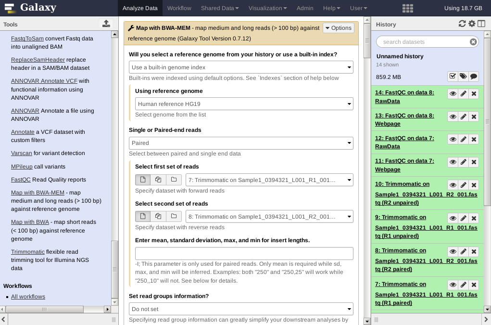
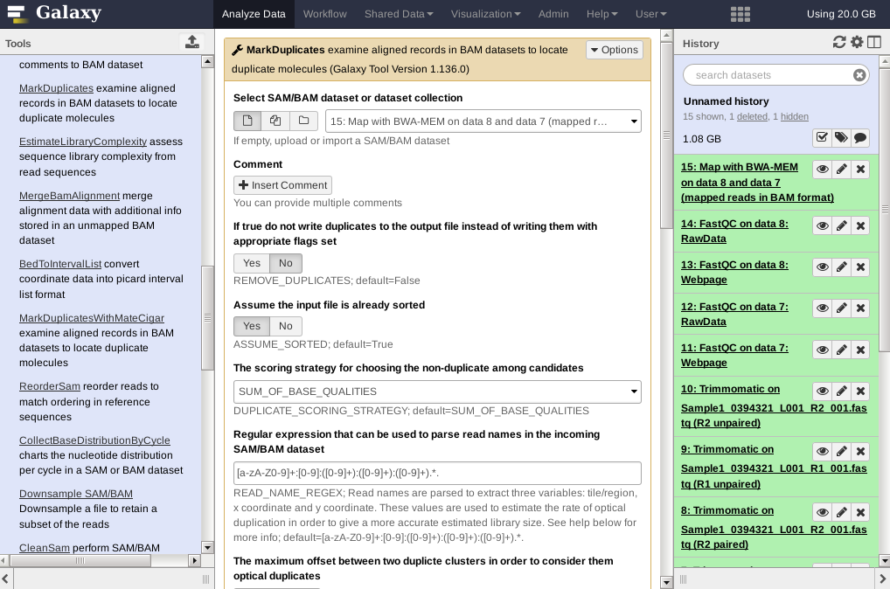
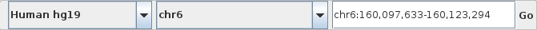
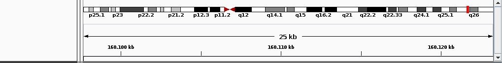
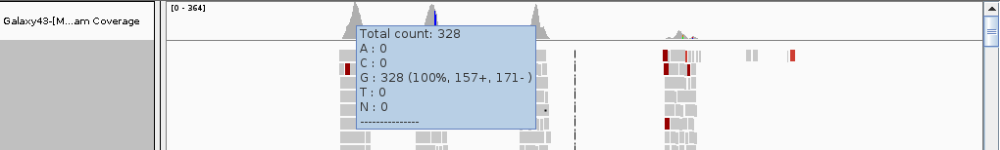
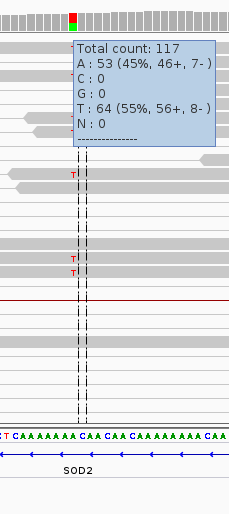

# Read Mapping {#mapping}

Now that we know what the quality is of the NGS patient data and have corrected the reads on low quality and short read lengths, we can continue with the mapping of our reads against a reference genome. In this step we use the human genome as a reference to which we will map the cleaned reads using the tool BWA. After mapping the reads we can look for variations between the reference and our patient. 

## Mapping with BWA {-}

Before starting with mapping the data to the human reference genome, we can calculate some important statistics to see what we can achieve with our data.

## Assignment week 2

The *[coverage][1]* is the number of reads that were mapped at a given position and it is considered a good measurement to determine if there was enough data for further analysis. To identify significant variations, we aim for a minimal coverage of **20**, any lower and it becomes hard to differentiate between a true variant and a sequencing error. Given the Illumina platform and given these facts:
<ul>
    <li>a minimal average coverage (read depth) of 20,</li>
    <li>the read length is determined by your data set (for instance a read pair with each read having 75 or 150 bases),</li>
    <li>the human genome size is 3,137,161,264 bases and</li>
    <li>the target region (captured region, size of the gene panel) totals 320,000 bases for the Cardio panel or 1,000,000 bases for Medulloblastoma. This differs for your chosen case and has to be calculated by you.</li>
</ul>

We can use the Lander/Waterman equation to calculate our actual expected coverage: $$ C = LN / G $$
Where: 
<ul>
    <li>`C` is the coverage,</li>
    <li>`L` is the read length and</li>
    <li>`N` is the number of reads</li>
</ul>

From your own cleaned data set, look up how many reads are left for mapping. Calculate the expected coverage if we use this data for your gene panel (`G` = captured region). An Illumina MiSeq V3 can produce up to 25 million reads of length 300, how many patients could you analyse per run if the minimum coverage is 20 and you where using your gene panel? Calculate these assignments in R within your document.

Select the correct **Map with BWA** tool from the Tools menu (depends on your read length). For the mapping we will be using a built-in genome of which there are *many* available. Select the <strong>Human reference hg38</strong> in the reference genome setting. Select paired end reads.

From your previous experiments with different FASTQ cleaning settings, select the R1 paired Trimmomatic data as the first set of reads and the R2 paired Trimmomatic as the second set of reads. Execute the tool, this will take a while to run (10 - 20 minutes).

```{r, echo=FALSE, fig.align="center", out.width="80%"}

```

[1]: https://en.wikipedia.org/wiki/Coverage_(genetics)

## Marking Duplicate Mapped Reads

In the process of creating the reads, *[duplicates](http://www.cureffi.org/2012/12/11/how-pcr-duplicates-arise-in-next-generation-sequencing/)* may have arisen by PCR artifacts. These duplicate reads are not real biological sequences in the sense that they originate from the sample, but are a technical artifact. In downstream analysis these duplicate reads may generate false positive variants. Can you think of a reason why this is the case?

Before we are going to look at any differences between the reference and our patient, we first have to *mark* the duplicate mapped reads. To do this, select the [MarkDuplicates](http://broadinstitute.github.io/picard/) tool from the Tools menu. Select the *Map with BWA-MEM output on data ... and ....*, set the <strong>Assume input file is already sorted option</strong> to No and Execute the tool. This tool will add a *flag* to each read that it finds as being duplicate and other tools will ignore any read that has this flag. It will therefore not *remove* the read from the data.

```{r, echo=FALSE, fig.align="center", out.width="80%"}

```

## Visualizing the Mapping Data

We are going to look at the actual mapping to get a bit of feel for what has happend till now. To do this we will look at the mapping output from the previous step - with the marked duplicates - in a *Genome Browser*.  

On our system the *Integrated Genome Viewer* ([IGV](http://software.broadinstitute.org/software/igv/)) has been installed. First we need to download the mapping data to our computer. To do this, download the <strong>dataset</strong> and <strong>bam_index</strong> files from the markduplicates output in Galaxy as shown below. 
 
```{r, echo=FALSE, fig.align="center", out.width="80%"}
knitr::include_graphics("images/bamDownload.png")
```

Select <strong>Save File</strong> in the pop up window.

Open IGV either by going to the (Linux) <strong> Applications Menu -> Run Program...</strong> and type in <strong>igv</strong> and click on <strong>launch</strong> or by opening a terminal and entering the **igv** command. Next, you can load the mapping data into IGV by clicking on <strong>File -> load from File...</strong>. Look in your <strong>Downloads</strong> folder for a file name starting with **Galaxy** and ending with <strong>.bam</strong> (you only need to open the BAM file, the index file is automatically loaded).

Because our sequence reads are from captured exomes, you have to zoom in quite a bit to see any of the mappings. Too help you find where to zoom in, we can add an extra layer to the genome browser (called a track). The Galaxy server hosts the details of the available gene panels for that purpose. You can download the file for your case by going to <strong>Shared Data -> Data Libraries -> case_name</strong> in the Galaxy browser. Select <strong>case_name.BED</strong> and click on the <strong>to History</strong> button (replace the case_name with your actual case). Please have a look at the file in you History. The file consists of 4 columns, which describe the chromosome number, exon start location, exon end location and the gene name. Download this file (*Save File*) to your computer.

Now, in IGV, again select <strong>File -> Load from File..</strong>. Select the downloaded `BED` file and open this. IGV will now display a new track containing all exons of interest (for the SOD2 gene in this example):

```{r, echo=FALSE, fig.align="center", out.width="80%"}
knitr::include_graphics("images/igvMain.png")
```

From the 4th column in the bed file, choose a couple of gene names to inspect. The shown `SOD2` gene is located on chr6 and has 5 exons and is part of the Cardiomyopathy gene panel.

In IGV type in the name of your selected gene in the search box and click on Go. 

```{r, echo=FALSE, fig.align="center", out.width="50%"}

```

The screen will load the mapping results of the region that includes the selected gene. 
A couple of regions are important in this genome browser screen. The top row shows the location you are looking at now (red vertical bar on the chromosome): 

```{r, echo=FALSE, fig.align="center", out.width="70%"}

```

The bottom tracks show the locations of the reference human genes and the locations of our gene panel captured exons. Note that due to splice variants, not all exons are of interest; in this example, the last exon (first one from the left, the `SOD2` gene is on the reverse strand) is not part of the gene panel: 
```{r, echo=FALSE, fig.align="center", out.width="70%"}
knitr::include_graphics("images/IGVrefseqBed.png")
```

The middle part is the actual mapping data of which the first tarck shows the coverage plot showing how many reads where mapped at this position and what the nucleotide distribution is at this position (when hovering on a position with the mouse cursor). Also the number of forward and reverse reads is shown. In this case at this position there where 328 reads mapped. It also tells us that 100% of the reads have a G at that position (157 in the forward mapped reads and 171 in the reverse mapped reads)

```{r, echo=FALSE, fig.align="center", out.width="70%"}

```

Below the coverage track the actual mapping data is displayed. We mapped paired-end reads and to make this visible in IGV, right click the mapping track and select <strong>View as pairs</strong>. Reads are colored according to their read orientation and insert size. Look in the [IGV online manual](http://www.broadinstitute.org/software/igv/AlignmentData) for the explaination of the colors. 

Zoom in on your gene of interest. Regions of reads that are grey of color indicate a similar region as the reference. Variants are shown by colored vertical bars (each nucleotide has its own color). Zoom in till you have the nucleotide sequence showing for a variant. In our example we are looking at a T variant for this patient at this position. We see that a total of 117 reads were mapped at this position and that from all reads 64 had a T and 53 had a A at this position. The patient is *heterozygous* for this allele. Can you see if this variant is in an exon or not?, what are the consequences of a variant in an exon location? 

```{r, echo=FALSE, out.width="25%"}

```

**Assignment:** look for a variant in an exon within your own mapping data. The bottom row will show the translation from DNA to protein. Does the found variant causes a change (*non-synonymous*) or is the aminoacid sequence the same (*synonymous*)? Note that you need to take the gene orientation into account. The black arrow on the bottom left in IGV near the amino acid translation track is clickable to change the orientation. 

During the next steps we will answer questions for your own data set, such as: how many variants are found?, how many of these are located within exons? how many variants actually cause an aminoacid change? We will not do that manually using IGV as this tool uses a very naive variant calling method and this will result in many false positives. So we are going to use a more sophisticated method in the next chapter.