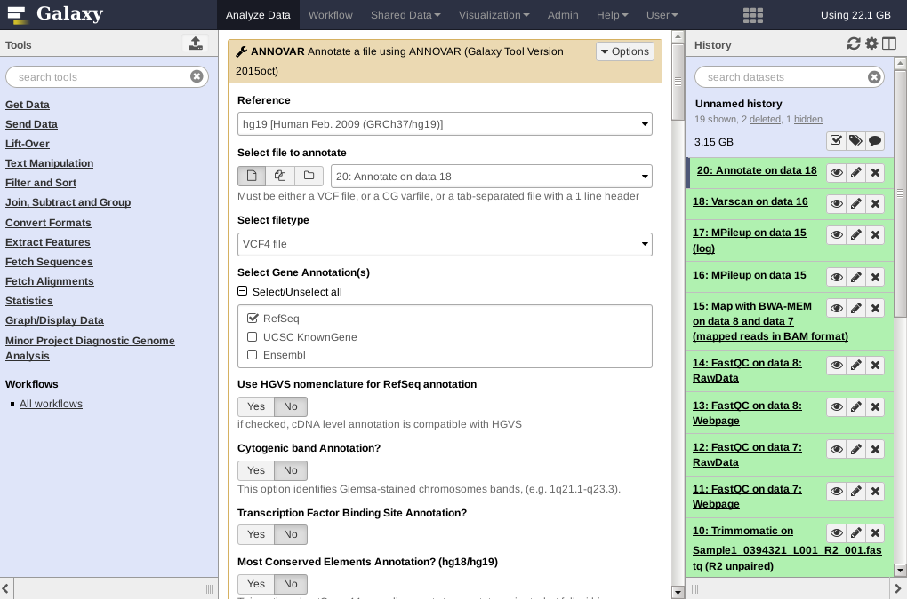

# Annotations

<!-- http://nar.oxfordjournals.org/content/38/16/e164 -->

In the - for now - final Galaxy workflow step for analyzing our patient, we are going to annotate all our filtered variants to determine the severity of the variations we determined last time with the `Varscan` tool. This involves comparing all our variants against a number of databases containing *annotation data* for known variants. We will use our filtered `VCF`-file resulting from Varscan so we need to upload our newly created VCF file (the output from `deliverable8.py`) to Galaxy. Make sure that Galaxy recognizes the file type by selecting the correct file type when uploading or change it afterwards using the *Edit attributes* button.

<!--
<strong>NOTE:</strong> In the previous step we removed the first 24 lines from the vcf file. These first 24 lines are actualy needed by this step. So before we proceed, we should rerun our previuous script and not delete those lines, but write them also to the output file. You can upload your filtered vcf file to galaxy to work on. Select the <strong>upload button</strong> which is in the upper left corner next to the <strong>Tools</strong>. Select the <strong>Choose local file</strong>. Set the type to <strong>vcf</strong> and the genome to <strong>hg19[Human feb. 2009(GRCh37/hg19)]</strong>
-->
```{r, echo=FALSE}
knitr::include_graphics("images/upload.png")
```


## Running Annovar

Select the [**ANNOVAR**](http://annovar.openbioinformatics.org/en/latest/) tool by searching for its name or selecting it from the *Diagnostic Genome Analysis* tool menu. This tool offers a lot of configuration options in the form of selectable sources for comparison. Note that not all of these sources are actually available in our Galaxy server, so take care when selecting the proposed options below.

Set the following settings and data sources from the tool configuration as follows:

* **Reference**: `hg19` [Human Feb. 2009 (GRCh37/hg19)]
* **Select file to annotatte**: your uploaded **filtered** VCF file
* **Select filetype**: `VCF4 file`
* **Select Gene Annotations**: `Select all`
* **Select dbSNP version(s) to annotate with**: `138 (hg19 only)`
* **Select 1000Genomes Annotation**: `2015aug (hg19/hg38) (6 populations: AMR,AFR,EUR,EAS,SAS,ALL)`
* **Select Exome Variant Server version(s) to annotate with**: `ESP6500si European Americans`
* **Annotate with ExAC 03?**: `Yes`
* **CLINVAR Annotation? (hg19 only)**: `Yes`
* **Select functional impact scores (LJB2)**: `Select all`
* **Also get predictions where possible?**: `Yes`

With all these options selected, Execute the tool.

```{r, echo=FALSE}

```


Download the resulting `.tabular` file to your computer and open it with Excel or the Linux alternative (you might need to change the file extension to `.tsv` (for *tab separated values* format) for Excel to recognize the file). As you will see, the file looks like the input-VCF file, but a large number of columns are added containing the annotation data from all the selected data sources. 
* Create a table in your report where you summarize the added columns (very!) briefly;
    * The database where the data comes from
    * The result or value (is it an identifier, a percentage, etc.). Section 7.2 below contains links to sources for some of the most important annotation sources.
    * **Hint**: you can add formatted tables in markdown with some syntax which is easiest generated at [https://www.tablesgenerator.com](www.tablesgenerator.com/markdown_tables)


## 7.2 Programming Assignment; Analyzing Variant Annotation

Given the possibly hundreds of annotated variants with data from multiple data sources, it's time to do one last *filtering* on the data to come up with a list of variants of which we can say, with some certainty, that they are related to the condition. As with the VCF-filter tool that we've written, here too will we check each line and decide if it is a variant worth reporting on. Whether we want to keep a variant or not depends on the annotation added by ANNOVAR and it is your task to come up with an approach for **combining** data from these data sources to *rank* the annotated variants.

From all the annotation columns we need to get - at least - the following data for each variant. 
Note: for some of these data sources only a few of your variants are actually annotated.
Note: the list below links to the Annovar documentation regarding this value; read these documents to at least *know* what they mean.
* The gene name from the `RefSeq_Gene` column,
* the gene 'function' from the `RefSeq_Func` column (see the [table of possible values](http://annovar.openbioinformatics.org/en/latest/user-guide/gene/#output-file-1-refseq-gene-annotation) for this column),
* the [**dbsnp**](http://annovar.openbioinformatics.org/en/latest/articles/dbSNP/) identifier,
* the 1000-genomes data for the `EUR` population group (the others are not of interest),
* the [**sift**](http://annovar.openbioinformatics.org/en/latest/user-guide/filter/#-sift-annotation) value from the `LJB2_SIFT` column,
* the [**polyphen**](http://annovar.openbioinformatics.org/en/latest/user-guide/filter/#-polyphen-2-annotation) value from one of the `LJB2_PolyPhen2_*` columns and
* the [**clinvar**](http://annovar.openbioinformatics.org/en/latest/user-guide/filter/#clinvar-annotations) value.


### Assignment 10; Data Preparation

This programming assignment asks to take another good look at the data, but now in R to see if everything is in a suitable format to eventually sort the data and extract a top-set of variants related to the condition.

* Load the data into R using your function of choice. Note that choosing the proper separator character is important.
* Print the structure of the resulting data-frame and inspect all columns on their data type.
* Columns that contain mixed data, in a single value, should be converted such that sorting is possible (look at the `LJB2_PolyPhen2_*` columns)


### Assignment 11; Finding Variants of Interest

Given the knowledge we have on the data stored in the data-frame, we can now formulate questions to this data to find a set of variants which are most likely linked to the cardiomyopathy condition. This condition cannot be identified by a single variant but is often caused by several variants and the combination not only determines *if* someone suffers from cardiomyopathy but also how *badly* their condition is. 

The physisian who diagnoses patients uses the genetic information of the found variants as one of the sources for confirming the condition. However, presenting a list of 100+ variant positions with a list of numbers from some tools is not how that works in practice; we need to present a short, ordered list of variants that can be related to the condition. 

Next, define your own sorting, filtering, selecting, etc. procedure to filter and order a top-list of variants that you'd present as aid to a diagnoses. For instance, you might have a variant that had a hit in the Clinvar database which directly links it to cardiomyopathy, this should probably be somewhere around the top of your list. Again, look at the output description that you've written earlier to come up with combination(s) of values. There is no golden standard for selecting these variants so it is very important to properly document and argument your decisions.

As an end product for this step you are expected to include a nice table including at least 10 variants in your report that contains all relevant information for each of them, i.e. the chromomsome, position, reference and variant nucleotides, gene name and all relevant scores.

For all of your variants, try to (briefly!) answer the following questions for each variant:
* Can you find a link between cardiomyopathy and the variant?
* What is the effect of the variant?
* Is it validated?
* Are there scientific studies supporting the evidence?
* What does the score indicate?
* What else can you find about the variant?

You can use the following online sources amongst others:  
* http://www.ncbi.nlm.nih.gov/snp/  
* http://www.ncbi.nlm.nih.gov/variation/tools/1000genomes/  
* http://www.ncbi.nlm.nih.gov/projects/SNP/

## 7.5 Galaxy Workflow

Now that we have completed our analysis steps we can create a **Galaxy workflow**. In this workflow we will combine all the tools that we have used in Galaxy (FastQ files --> ANNOVAR annotated output) so that when we receive new patient data in the future we can analyze that dataset with a single click!

There are many [online resources](https://galaxyproject.org/learn/advanced-workflow/) giving instructions and examples for creating Galaxy workflows, use these resources to create a workflow including all used analysis tools. Note that you can convert Galaxy histories into workflow(s), which saves a lot of time with Annovar for instance as this tool requires a lot of configuration.

Once you have a workflow, make sure it is shared with your project partner and create a screenshot of it for your report (try to fit all tools in a single image).


**Note**; this assignment has a very low priority and should be done once you are satisfied with all other parts of your work! At the bare minimum, open your last history (including Annovar) and explore/ play with the `Extract Workflow` option.

<!--
## Project Deadlines

There are multiple deadlines for finalizing this project:
* Programming assignments: all graded deliverables (7, 8, 9 and 12) *must* be available on your BitBucket repository on **Friday November the 3rd, 24.00h** (even if incomplete, make sure that the latest version(s) are available).
* Journal/'report': the OneNote documents are downloaded for grading on **Thursday November the 16th** and the final grade is available on Friday the 17th of November. 
-->

## 7.6 Comparative Genomics

With the complete analysis nicely packaged into a single workflow, one thing that we can use it for is to do *comparative genomics*. This term contains many different types of comparisons and is described on Wikipedia as 

> *Comparative genomics is a field of biological research in which the genomic features of different organisms are compared.*

These features can be of many types and in our case they are the variants. A simple tool is available in Galaxy called *VCF-VCFintersect* that performs either *intersection* or *union* on two VCF datasets containing variant data. This tool compares two VCF files and retains either the shared variants (intersection) or all variants combined (union) as shown in the diagram below.

```{r, echo=FALSE}
knitr::include_graphics("images/intersect_union.png")
```


**Assignment**

* Process another patient sample (use a new history) by running your complete workflow. 
    + Note that you have to filter the resulting ANNOVAR output (which contains the same data as the VCF file appended with annotation data) with the BED-data. Alternatively, you can stop after the Varscan tool, download the VCF file, filter this using the BED-data and re-upload the filtered VCF file before continuing with ANNOVAR
* Calculate the following three statistics:
    + The number of variants unique to patient 1
    + The number of variants unique to patient 2
    + The number of variants found in both patients
* Create a VENN-diagram (like the image above) displaying these numbers.

## 7.7 Galaxy Data Cleanup

As a final closing assignment we ask you to clean up the Galaxy histories to save some space because it is difficult for the admin(s) to perform this cleaning for you. Once all products are finished, please consider removing all large files from your history, such as the outputs of the trimming (Trimmomatic), mapping (BWA), duplicate read marking (MarkDuplicates) and the pileup steps (Mpileup). For the large files, please make sure that you *also* click the *Permanently remove it from disk* link.

First click on the `deleted` link at the top of your history<br/>
<br/>
Then, find the deleted elements and click on the permanently remove link.<br/>

