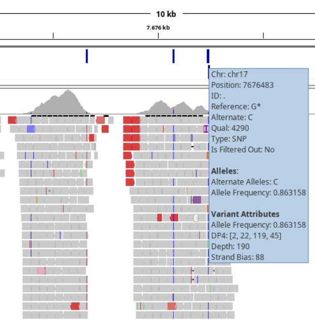

# Finding and Annotating Variants {#variants}

Most likely you've already seen how a true variant (not a single or few mismatches) looks when we looked at the data in the IGV-browser. For such a variant you see a number of reads having a different base at that positions compared to the reference genome. As we've mentioned before, we are interested in all these variants in our patient data for the all the genes in our gene panel. The previous *visualize-your-data* assignment did not ask to find all these variants using the IGV-browser because in this section we are going to use a program to do this for us.

## Finding Variants

The tool that we will use is the [LoFreq](https://csb5.github.io/lofreq/) tool that scans the BAM file for variants. This tool has a few settings that, combined, defines when a position is called a variant. You could do this in a naive way and just report for each position if there is a change. But this will result in many false positive variants (can you explain this?). We need a more statistical approach to filter out low quality variants and that's why the tool has settings to for instance set the minimum amount of reads (coverage) at a position to consider looking for variations. Also the variants itself should be supported by a minimum number of reads and the base quality of that position should not be too low.

**Instructions**:

Run the `Call variants with LoFreq` tool using its default settings. Select the output BAM file from the Mark Duplicate tool and use the available `GRCh38` reference genome. Feel free to explore the other options but leave the `Call variants across` settings on `Whole reference` (this setting allows using a BED file for only selecting variants of interest which is basically the following assignment).

### VCF File Filtering

The result of the LoFreq tool is a single new file in your history in the [**vcf**](http://www.internationalgenome.org/wiki/Analysis/vcf4.0/) file format where each line describes a single variant. In Galaxy you can then directly see how many variants you have; often well over 1000 in total. Note the 17 comment-lines at the top of the file.

When looking at this file in more detail it is fairly easy to see variants in places we are not interested in. As you've seen in IGV, many regions have been sequenced outside of our genes of interest, or even very far from a gene at all. LoFreq also checked those regions for variants and this assignment asks to filter the list of variants only keeping those within exon boundaries of our genes of interest. Then, another filtering step is filtering on actual variants. We do this by looking at the [allele frequency](https://en.wikipedia.org/wiki/Allele_frequency) value included in the VCF file. In our case, this value describes the percentage of reads having the **variant** base.

### Assignment 8; VCF File Processing

Please briefly read the linked Wikipedia page to understand why this value is of importance. As we are working with patient data, we use the protocol as described by the UMCG that states that variants with a minimum frequency of **30%** are retained. This means we will filter out any variants with a *lower* value. Note that LoFreq stores this value as a fraction so we filter for values $>= 0.3$.

There are once again step-by-step instructions for completing this assignment. It is however possible to do it without these instructions as we partly repeat steps we've taken in the previous assignments.

1. Read in the data into a data-frame using the `read.delim` function
    * Make sure the data has a proper header (line 18 in the data)
    * Provide the `stringsAsFactors = FALSE` argument, otherwise the next part won't work (we cannot split an R `factor`)

Now that we have the data in a data-frame, inspect that everything is loaded correctly. The first thing that we'll do now is get the frequency value for each variant. Read the comment lines in the VCF file to see how this value is stored. You'll see that the columns themselves contain more fields, separated by a semicolon (`;`) which we can use to *split* the data to get to the value we want.

2. Split the column containing the frequency value using the `strsplit` function

The output of this function is a list in which each item is a vector with the separate items resulting from the split (inspect this object in RStudio). To get the frequency value from this list, here is some R magic that converts the result from `strsplit` into a matrix (found on [Stackoverflow](https://stackoverflow.com/questions/20428742/select-first-element-of-nested-list)):

```{r, echo=TRUE}
head( do.call(rbind, bed_splitted), n=20)
```

What it does is `rbind`s all vectors into a matrix. Again, inspect this object to see where the actual value is located that you want (use the `View` function in RStudio or click on the name in the `Environment` tab).

3. Perform the following steps on the column containing the frequency value:
    * remove the `AF=` part using the `gsub` function
    * converts the data type of this column to `numeric`
    * saves only this column into a new variable

We now have the frequency value available for filtering and we'll do that by adding it to the `GRanges` object we create next:

4. Create a `GRanges` object as we've done for assignment 3 by simply creating an `IRanges` object where the `start` and `end` parameters both get the variant position column (`POS` column). Also provide the `seqnames` parameter to `GRanges` which get the contents of the chromosome column. Note that we do not need to use a `for`-loop for this.

`GRanges` objects can contain other data as well, called *associated metadata*. Using the `mcols` function we can see existing or assign data to each variant. Adding this as a data-frame allows us to set a name for this column as demonstrated below with an example from the previous chapter:

```{r, echo=TRUE}
# Select and show data for a single gene (note that it specifies "... and 0 metadata columns")
# ('granges' object is used from assignment 3)
granges
```

```{r, echo=TRUE}
# Generate some random values for 'allele frequency'
allele_frequency <- round(rnorm(5, mean = 0.45, sd = 0.35), 1)

# Bind this data to the 'GRanges' object
mcols(granges) <- DataFrame(AF=allele_frequency)

granges
```

Use the example above to associate the frequency value with the created `GRanges` object. Now that we have both the BED-data (in a `GRangesList` object) and the VCF data in a `GRanges` object, we can 

5. Get all variants that fall within an exon
    * Use the `findOverlaps` function and store its output
      - this requires the `query` and `subject` parameters to be set to the *variants* and *BED*-`GrangesList` objects respectively
    * Convert the output to a data-frame using the `DataFrame` function
    
The result from `findOverlaps` contains two columns of which we are interested in the `querytHits` column; the rows from the VCF data that lie within an exon. You can use this column to subset the `GRanges` VCF object with. Note that the `subjectHits` column describes not the exons but the genes; meaning a subjectHit value of `1` refers to a hit within any of the first gene exons (`ABCC9` in case of the cardiopanel).

6. Filter the **remaining** variants based on their frequency, using a minimum of **30%**
    * Instead of removing rows or creating another subset, make sure you know which rows are to be kept after both filtering steps as we are going to reconstruct the original VCF file (we need it in Galaxy)
    * Manually sample a few rows to see if they do fall within an exon and have a frequency > 30%

7. Now that you have all the row numbers of variants that we want to keep, you need to think of a way to re-construct the VCF file and save it to disk.
    * Hint: read in the VCF file again for sub-setting using the `readLines` function
    * Note: do not forget to include the 17 header lines!

8. Upload the new VCF file into Galaxy as we'll use it in the next chapter.

### Assignment 9; Variant Visualization

We will create two simple visualizations:

* Visualize the **allele frequency** for all remaining variants using the `hist` function. Remember that you can use the `mcols` function to get a metadata column or use the `$`-sign and the name of the column. Pass the argument `breaks=20` to `hist` and answer the following question in your lab-journal:
    - Can you explain the two peaks that you see in your histogram (around 50% and 100%)? 
* Visualize the amount of variants per gene. A simple solution for getting the numbers is to use the `table` function on the `subjectHits` column (output of `findOverlaps` where `subject` are the *genes*). Convert it to a data frame and then use the gene indices to get the actual gene names. Now you should have a combination of gene and number of variants. Create a barplot with this data as in the previous chapter and use `cex.names=0.7` to scale the gene names to make them all visible.

It is also possible to add the VCF file to IGV (together with the mapping- and BED-files) and visualize the variants in the context of the genes. This is however not a requirement for this assignment.

```{r, echo=FALSE}

```

## Variant Annotation

In the - for now - final Galaxy workflow step for analyzing our patient, we are going to annotate all our filtered variants to determine the severity of the variations we determined last time with the `LoFreq` tool. This involves comparing all our variants against a number of databases containing *annotation data* for known variants. We will use our filtered `VCF`-file resulting from LoFreq so we need to upload our newly created VCF file to Galaxy. Make sure that Galaxy recognizes the file type by selecting the correct file type when uploading or change it afterwards using the *Edit attributes* button.

```{r, echo=FALSE}
knitr::include_graphics("images/upload.png")
```

### SnpEff and SnpSift

::: {.rmdnote}
Note [06/10/2025]: due to issues in Galaxy, step **3** has to be done *commandline*:
  
After completing step 2 (see below), download the VCF file (named `variants_step2.vcf` in step 3 below) from Galaxy and copy it to your project folder on the network. RStudio can be used to upload/download files to and from our network.

* Step 3: SnpSift dbNSFP annotation:
  - Using the output from step 2 (`variants_step2.vcf`), we will add more annotation from dbNSFP using the following command: `java -jar /data/datasets/dbNSFP/snpEff/SnpSift.jar DbNsfp -db /data/datasets/dbNSFP/snpEff/data/dbNSFP4.3c.txt.gz variants_step2.vcf > variants_step3.vcf`
  
Annotating against dbNSFP can take a *long* time. Make sure to start these command from within a `bash` chunk in RStudio.
:::

There are multiple methods of annotating found variants. Most of these will require extra data to predict the effect of a variant or to compare it with a known set of variants. Here we use a set of tools that does both types of annotation. See for further details and a manual the [Github documentation](http://pcingola.github.io/SnpEff/).

* **`SnpEff`**: *is a variant annotation and effect prediction tool. It annotates and predicts the effects of genetic variants (such as amino acid changes)*
* **`SnpSift`**: *is a toolbox that allows you to filter and manipulate annotated files.*
  - actually, this tool also annotates variants using a variety of data sources, for which we will use it.
  
Both tools are available in Galaxy with numerous sub-tools depending on the task that you want to do. To get the most information for each variant, we will perform three annotation *runs*:

**Step 1**: Using SnpEff to annotate variants using the `GRCh38.105` database adding information related to the gene, transcript and protein that are affected by this variant. This results in a lot of extra data that is all documented in the changed VCF header. 

For example, given the following variant as input:

> `chr1	237550644	.	C	A	91.0	PASS	DP=578;AF=0.017301;SB=1;DP4=252,316,5,5`

This is the result after SnpEff:

> `chr1	237550644	.	C	A	91.0	PASS	DP=578;AF=0.017301;SB=1;DP4=252,316,5,5;ANN=A|missense_variant|MODERATE|RYR2|ENSG00000198626|transcript|ENST00000366574.6|protein_coding|27/105|c.3167C>A|p.Thr1056Lys|3484/16562|3167/14904|1056/4967||,A|missense_variant|MODERATE|RYR2|ENSG00000198626|transcript|ENST00000360064.7|protein_coding|25/103|c.3119C>A|p.Thr1040Lys|3119/14850|3119/14850|1040/4949||WARNING_TRANSCRIPT_NO_START_CODON,A|downstream_gene_variant|MODIFIER|SNORA25|ENSG00000252290|transcript|ENST00000516481.1|snoRNA||n.*4396G>T|||||4396|`

All details are added in the `ANN` field. See the description in the VCF header for a field-by-field explanation of the values. 

**Running SnpEff**:

* Select the `SnpEff Variant effect and annotation` tool from the `Variant Calling` tool menu in Galaxy. 
* Select the uploaded VCF file containing the variants filtered for the cardiopanel or medulloblastoma genes. 
* For the **Genome source**, select 'Download on demand'
  - For the 'Snpff Genome Version Name' option, enter `GRCh38.105`.
* Leave all other options default and execute.

The result consists of two files: an annotated VCF file and a web-report on all the variants and their predicted effects.

**Note**: Sometimes errors are produced due to different naming conventions for chromosomes. Check if chromosome names are in 'human readable' format (i.e.: 1, 2, 20, X, Y, ..) instead of NCBI notation (i.e.: NC_000001.11, NC_000003.12, NC_000011.10, etc.). To change from 'NC_000011.10' to '11', run the following commands:

* Compress the VCF file: `bgzip -c variants.vcf > variants.vcf.gz`
* Index the VCF file: `tabix -p vcf variants.vcf.gz`
* Rename chromosomes using `bcftools`: `bcftools annotate --rename-chr /data/datasets/dbNSFP/chr_conversion_table.txt variants.vcf.gz > variants.vcf` Note: overwrites original 'variants.vcf'

**Step 2**: Adding `dbSnp` entries using `SnpSift`. The [dbSnp](https://www.ncbi.nlm.nih.gov/snp/) database contains information on known variants. The version that also includes clinical significance (combining the ClinVar database) is available for the SnpSift tool in Galaxy. 

**Running SnpSift for dbsnp**: 

* SnpSift requires the `dbSnp` database to be available in your history:
  - Upload both files from `/commons/Themas/Thema05/2025/dbSnp/` (VCF file and it's index) into Galaxy
* Select the `SnpSift Annotate SNPs from dbSnp` tool from the `Variant Calling` tool menu in Galaxy.
  - **Note**: this is a different tool from the `dbNSFP` database, see step #3 below.
* Select the output VCF file created by SnpEff in step #1 as the `Variant input file`.
* Select the `dbSnp_clinvar.vcf.gz` file as the `VCF File with ID field annotated`.
* Disable the `Only annotate ID field (do not add INFO field)` toggle.

This tool adds annotations in two columns. First, the `ID` column will describe the `dbSnp` ID (rs number) that can be used to look up the variant. Second, the `INFO` column is expanded with (a lot of) extra information if the variant is known. For instance, the ClinVar data might report on diseases the variant is related to, such as:

> `CLNDN=Cardiovascular_phenotype|Charcot-Marie-Tooth_disease|Lipoatrophy_with_Diabetes,_Hepatic_Steatosis,_Hypertrophic_Cardiomyopathy,_and_Leukomelanodermic_Papules`

**Step 3**: Annotating using the `dbNSFP` database and SnpSift. The dbNSFP database is a huge collection (over 300GB of text files) of annotation sources combined into a single database. The SnpSift tool can compare our variants with known variants from all of these annotation sources and - like the first few steps - adds them to our VCF file. As you can expect, our VCF file will become very large and most likely unreadable. Therefore, we re-use the VCF file gained from step #1 instead of the VCF file from SnpSift in step #2. We can later combine the data after parsing both files separately.

**Running SnpSift for dbNSFP**:

* Select the `SnpSift dbNSFP` tool from the `Variant Calling` tool menu in Galaxy.
* Use the VCF file from step #1 as input
* Select the locally available `GRCh38 dbNSFP4.3c` Genome database
* Select all options for the `Annotate with` option

Note that the tool description lists output not available for selection, we will look into the specifics of all selected databases later on.

<!--

Commandline SnpEff and SnpSift for 2.1.2

Step #1 SnpEff

cd /local-fs/datasets/dbNSFP/snpEff/;
java -jar snpEff.jar ann GRCh38.105 /homes/marcelk/Development/NGS-Genetics/solution/bed_variants.vcf > /homes/marcelk/Development/NGS-Genetics/solution/bed_annotation.vcf
----------

Step #2 SnpSift - dbSnp

/local-fs/datasets/dbNSFP/snpEff/scripts/snpSift annotate /local-fs/datasets/dbNSFP/snpEff/data/clinvar.vcf.gz /homes/marcelk/Development/NGS-Genetics/solution/bed_variants.vcf > /homes/marcelk/Development/NGS-Genetics/solution/bed_annotation.vcf
----------

Step #3 SnpSift - dbNSFP with all options:

/local-fs/datasets/dbNSFP/snpEff/scripts/snpSift DbNsfp -db /data/datasets/dbNSFP/snpEff/data/dbNSFP4.3c.txt.gz /homes/marcelk/Development/NGS-Genetics/solution/bed_variants.vcf > /homes/marcelk/Development/NGS-Genetics/solution/bed_annotation.vcf
----------

-->

### Assignment {-}

* Create a table in your report where you summarize the added annotation data (very!) briefly;
    * The database where the data comes from
    * The result or value (is it an identifier, a percentage, etc.).
    * **Hint**: you can add formatted tables in markdown with some syntax which is easiest generated at [https://www.tablesgenerator.com](www.tablesgenerator.com/markdown_tables)

The VCF header only describes the names of the databases the data originates from and does not give a clear explanation. There might be a single source for the documentation (please let us know if you find it!), but for now the best method of getting information about the added data is:

* **Step #1**: the output of the first step also includes a web report that at least gives more details on the results. Either use your biological knowledge or search for terms if they're unclear
* **Step #2**: data from the `dbSnp` database comes from the 'ClinVar' version of this database, which is documented [on its NCBI website](https://www.ncbi.nlm.nih.gov/variation/docs/ClinVar_vcf_files/).
* **Step #3**: for the `dbNSFP` database there are descriptions available on the online version:
  - Go to [the online dbNSFP instance](http://database.liulab.science/dbNSFP), select the **Academic** option and click **Connect**. 
  - If you hover over any of the selectable Variant fields, you can read a brief description of the data that is added.
  - Note that this is for dbNSFP version 4.4a and we use version 4.3c (very minor differences)

## Programming Assignment; Analyzing Variant Annotation

Given the possibly hundreds of annotated variants with data from multiple data sources, it's time to do one last *filtering* on the data to come up with a list of variants of which we can say, with some certainty, that they are related to the condition. As with the VCF-filter tool that we've written, here too will we check each line and decide if it is a variant worth reporting on. Whether we want to keep a variant or not depends on the annotation added by SnpEff/SnpSift and it is your task to come up with an approach for **combining** data from these data sources to *rank* the annotated variants.

### Assignment 10; Data Preparation

This programming assignment asks to take another good look at the data, but now in R to see if everything is in a suitable format to eventually sort the data and extract a top-set of variants related to the condition. As you have seen, all data is essentially stored in a single column that contains multiple separators (such as `|` and `;`). You need to think of and implement a good strategy to convert all this information into a workable data format, such as a data frame.

There are a few caveats though that can also be seen when looking at the SnpEff report (the 'stats' output). For instance, there are two lines in the overview table that describe the amount of variants and the amount of hits in the SnpEff database:

* `Number of variants (before filter)   	145`
* `Number of effects	    1,332`

Which means that on average every variant has about 10 (!) hits of which all data is placed in the `INFO` column (most notably in the `ANN` part of the `INFO` column). This is caused most often by multiple transcripts (alternative splicing) being affected by this variant. This makes it very difficult to parse and therefore this section gives tips and example code to assist in that task. With this much data from three different steps it is too complex to assess in a single run so we will assess annotation data step by step.

#### Step #1 & #2; SnpEff ANN data and SnpSift ClinVar data {-}

According to the VCF header, the `ANN` data contains the values explained in the [SnpEff documentation](https://pcingola.github.io/SnpEff/se_inputoutput/#ann-field-vcf-output-files). Some, or all of them could be of interest. There is a Galaxy tool available to extract interesting fields from the added data.

* Select the `SnpSift Extract Fields from a VCF file into a tabular file` tool from the tool menu
  - the tool help or [this manual](https://pcingola.github.io/SnpEff/snpsift/extractfields/) can provide more details
* Select the annotated VCF file as input
* Provide the names of the columns of interest. For instance, the following could be used as a query for the 'Fields to extract':
  - ```CHROM POS REF ALT ANN[*].EFFECT ANN[*].IMPACT ANN[*].GENE ANN[*].FEATURE ANN[*].FEATUREID ANN[*].BIOTYPE ANN[*].ERRORS CLNDN CLNSIG```
  - Add or remove any other column you find interesting to the above query.
* Enable the 'One effect per line' option
* Run the tool and download the resulting tabular file for analysis in R
  - The resulting file contains as many rows as effects reported by SnpEff (1332 in this example)

::: {.rmdnote}
Note: always include the `CHROM POS REF ALT` columns which are needed to identify the variant in the original file.
:::

#### Step #3; SnpSift dbNSFP {-}

Similar to the previous step, extract the fields of interest using the `SnpSift Extract Fields from a VCF file into a tabular file` tool. The `dbNSFP` entries are all prefixed with `dbNSFP_`, for instance: `dbNSFP_MutationAssessor_score` and `dbNSFP_SIFT_pred`. Once done, download this tabular file too for further analysis.

### Assignment 11; Finding Variants of Interest

Given the knowledge we have on the data stored in the two dataframes, we can now formulate questions for this data to find a set of variants which are most likely linked to the cardiomyopathy condition. This condition cannot be identified by a single variant but is often caused by several variants and the combination not only determines *if* someone suffers from cardiomyopathy but also how *badly* their condition is. 

The physician who diagnoses patients uses the genetic information of the found variants as one of the sources for confirming the condition. However, presenting a list of 100+ variant positions with a list of numbers from some tools is not how that works in practice; we need to present a short, ordered list of variants that can be related to the condition. 

Next, define your own sorting, filtering, selecting, etc. procedure to filter and order a top-list of variants that you'd present as aid to a diagnoses. For instance, you might have a variant that had a hit in the ClinVar database which directly links it to cardiomyopathy, this should probably be somewhere around the top of your list. Again, look at the output description that you've written earlier to come up with combination(s) of values. There is no golden standard for selecting these variants so it is very important to properly document and argument your decisions.

As an end product for this step you are expected to include a nice table including at least 10 variants in your report that contains all relevant information for each of them, i.e. the chromomsome, position, reference and variant nucleotides, gene name and all relevant scores.

For all of your variants, try to (briefly!) answer the following questions for each variant:

* Can you find a link between cardiomyopathy and the variant?
* What is the effect of the variant?
* Is it validated?
* Are there scientific studies supporting the evidence?
* What does the score indicate?
* What else can you find about the variant?

You can use the following online sources among others:

* http://www.ncbi.nlm.nih.gov/snp/
* http://www.ncbi.nlm.nih.gov/variation/tools/1000genomes/
* http://www.ncbi.nlm.nih.gov/projects/SNP/
