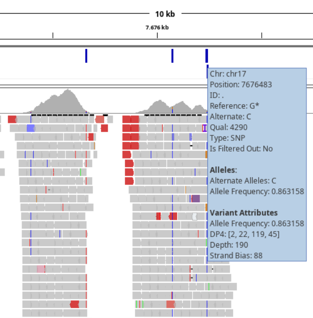

# Analysis of Variants {#variant-calling}

Once we are done with mapping all reads to the reference genome, we can determine the variant positions within the genes of interest. For this we use a Galaxy tool called *LoFreq* that will report on found variants and their statistics such as allele frequency, number of supported reads, average base quality at the found position, etc. 

## Finding and Annotating Variants {#variants}

Most likely you've already seen how a true variant (not a single or few mismatches) looks when we looked at the data in the IGV-browser. For such a variant you see a number of reads having a different base at that positions compared to the reference genome. As we've mentioned before, we are interested in all these variants in our patient data for the all the genes in our gene panel. The previous *visualize-your-data* assignment did not ask to find all these variants using the IGV-browser because in this section we are going to use a program to do this for us.

The tool that we will use is the [LoFreq](https://csb5.github.io/lofreq/) tool that scans the BAM file for variants. This tool has a few settings that, combined, defines when a position is called a variant. You could do this in a naive way and just report for each position if there is a change. But this will result in many false positive variants (can you explain this?). We need a more statistical approach to filter out low quality variants and that's why the tool has settings to for instance set the minimum amount of reads (coverage) at a position to consider looking for variations. Also the variants itself should be supported by a minimum number of reads and the base quality of that position should not be too low.

**Instructions**:

Run the `Call variants with LoFreq` tool using its default settings. Select the output BAM file from the Mark Duplicate tool and use the available `GRCh38` reference genome. Feel free to explore the other options but leave the `Call variants across` settings on `Whole reference` (this setting allows using a BED file for only selecting variants of interest which is basically the following assignment).

## VCF File Filtering {#variant-filtering}

The result of the LoFreq tool is a single new file in your history in the [**vcf**](http://www.internationalgenome.org/wiki/Analysis/vcf4.0/) file format where each line describes a single variant. In Galaxy you can then directly see how many variants you have; often well over 1000 in total. Note the 17 comment-lines at the top of the file.

When looking at this file in more detail it is fairly easy to see variants in places we are not interested in. As you've seen in IGV, many regions have been sequenced outside of our genes of interest, or even very far from a gene at all. LoFreq also checked those regions for variants and this assignment asks to filter the list of variants only keeping those within exon boundaries of our genes of interest. Then, another filtering step is filtering on actual variants. We do this by looking at the [allele frequency](https://en.wikipedia.org/wiki/Allele_frequency) value included in the VCF file. In our case, this value describes the percentage of reads having the **variant** base.

### Assignment 8; VCF File Processing

Please briefly read the linked Wikipedia page to understand why this value is of importance. As we are working with patient data, we use the protocol as described by the UMCG that states that variants with a minimum frequency of **30%** are retained. This means we will filter out any variants with a *lower* value. Note that LoFreq stores this value as a fraction so we filter for values $>= 0.3$.

There are once again step-by-step instructions for completing this assignment. It is however possible to do it without these instructions as we partly repeat steps we've taken in the previous assignments.

1. Read in the data into a data-frame using the `read.delim` function
    * Make sure the data has a proper header (line 18 in the data)
    * Provide the `stringsAsFactors = FALSE` argument, otherwise the next part won't work (we cannot split an R `factor`)

Now that we have the data in a data-frame, inspect that everything is loaded correctly. The first thing that we'll do now is get the frequency value for each variant. Read the comment lines in the VCF file to see how this value is stored. You'll see that the columns themselves contain more fields, separated by a semicolon (`;`) which we can use to *split* the data to get to the value we want.

2. Split the column containing the frequency value using the `strsplit` function

The output of this function is a list in which each item is a vector with the separate items resulting from the split (inspect this object in RStudio). To get the frequency value from this list, here is some R magic that converts the result from `strsplit` into a matrix (found on [Stackoverflow](https://stackoverflow.com/questions/20428742/select-first-element-of-nested-list)):

```{r, echo=TRUE}
head( do.call(rbind, bed_splitted), n=20)
```

What it does is `rbind`s all vectors into a matrix. Again, inspect this object to see where the actual value is located that you want (use the `View` function in RStudio or click on the name in the `Environment` tab).

3. Perform the following steps on the column containing the frequency value:
    * remove the `AF=` part using the `gsub` function
    * converts the data type of this column to `numeric`
    * saves only this column into a new variable

We now have the frequency value available for filtering and we'll do that by adding it to the `GRanges` object we create next:

4. Create a `GRanges` object as we've done for assignment 3 by simply creating an `IRanges` object where the `start` and `end` parameters both get the variant position column (`POS` column). Also provide the `seqnames` parameter to `GRanges` which get the contents of the chromosome column. Note that we do not need to use a `for`-loop for this.

`GRanges` objects can contain other data as well, called *associated metadata*. Using the `mcols` function we can see existing or assign data to each variant. Adding this as a data-frame allows us to set a name for this column as demonstrated below with an example from the previous chapter:

```{r, echo=TRUE}
# Select and show data for a single gene (note that it specifies "... and 0 metadata columns")
# ('granges' object is used from assignment 3)
granges
```

```{r, echo=TRUE}
# Generate some random values for 'allele frequency'
allele_frequency <- round(rnorm(5, mean = 0.45, sd = 0.35), 1)

# Bind this data to the 'GRanges' object
mcols(granges) <- DataFrame(AF=allele_frequency)

granges
```

Use the example above to associate the frequency value with the created `GRanges` object. Now that we have both the BED-data (in a `GRangesList` object) and the VCF data in a `GRanges` object, we can 

5. Get all variants that fall within an exon
    * Use the `findOverlaps` function and store its output
      - this requires the `query` and `subject` parameters to be set to the *variants* and *BED*-`GrangesList` objects respectively
    * Convert the output to a data-frame using the `DataFrame` function
    
The result from `findOverlaps` contains two columns of which we are interested in the `querytHits` column; the rows from the VCF data that lie within an exon. You can use this column to subset the `GRanges` VCF object with. Note that the `subjectHits` column describes not the exons but the genes; meaning a subjectHit value of `1` refers to a hit within any of the first gene exons (`ABCC9` in case of the cardiopanel).

6. Filter the **remaining** variants based on their frequency, using a minimum of **30%**
    * Instead of removing rows or creating another subset, make sure you know which rows are to be kept after both filtering steps as we are going to reconstruct the original VCF file (we need it in Galaxy)
    * Manually sample a few rows to see if they do fall within an exon and have a frequency > 30%

7. Now that you have all the row numbers of variants that we want to keep, you need to think of a way to re-construct the VCF file and save it to disk.
    * Hint: read in the VCF file again for sub-setting using the `readLines` function
    * Note: do not forget to include the 17 header lines!

8. Upload the new VCF file into Galaxy as we'll use it in the next chapter.

### Assignment 9; Variant Visualization

We will create two simple visualizations:

* Visualize the **allele frequency** for all remaining variants using the `hist` function. Remember that you can use the `mcols` function to get a metadata column or use the `$`-sign and the name of the column. Pass the argument `breaks=20` to `hist` and answer the following question in your lab-journal:
    - Can you explain the two peaks that you see in your histogram (around 50% and 100%)? 
* Visualize the amount of variants per gene. A simple solution for getting the numbers is to use the `table` function on the `subjectHits` column (output of `findOverlaps` where `subject` are the *genes*). Convert it to a data frame and then use the gene indices to get the actual gene names. Now you should have a combination of gene and number of variants. Create a barplot with this data as in the previous chapter and use `cex.names=0.7` to scale the gene names to make them all visible.

It is also possible to add the VCF file to IGV (together with the mapping- and BED-files) and visualize the variants in the context of the genes. This is however not a requirement for this assignment.

```{r, echo=FALSE}

```