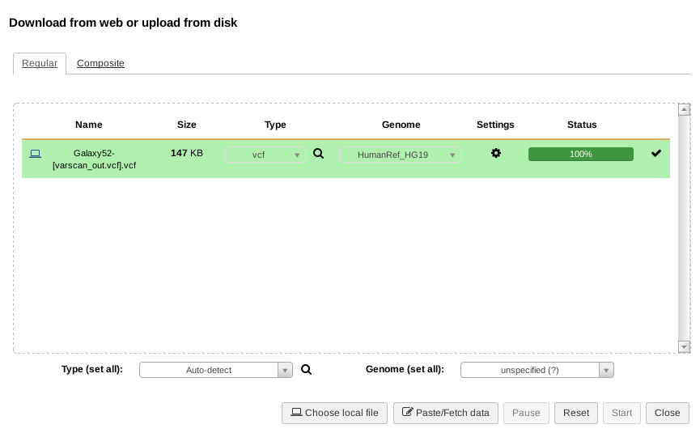

# Variant Annotation {#variant-annotation}

In the - for now - final Galaxy workflow step for analyzing our patient, we are going to annotate all our filtered variants to determine the severity of the variations we determined last time with the `LoFreq` tool. This involves comparing all our variants against a number of databases containing *annotation data* for known variants. We will use our filtered `VCF`-file resulting from LoFreq so we need to upload our newly created VCF file to Galaxy. Make sure that Galaxy recognizes the file type by selecting the correct file type when uploading or change it afterwards using the *Edit attributes* button.

```{r, echo=FALSE}

```

## SnpEff and SnpSift

There are multiple methods of annotating found variants. Most of these will require extra data to predict the effect of a variant or to compare it with a known set of variants. Here we use a set of tools that does both types of annotation. See for further details and a manual the [Github documentation](http://pcingola.github.io/SnpEff/).

* **`SnpEff`**: *is a variant annotation and effect prediction tool. It annotates and predicts the effects of genetic variants (such as amino acid changes)*
* **`SnpSift`**: *is a toolbox that allows you to filter and manipulate annotated files.*
  - actually, this tool also annotates variants using a variety of data sources, for which we will use it.

Both tools are available in Galaxy with numerous sub-tools depending on the task that you want to do. To get the most information for each variant, we will perform three annotation *runs*:

**Step 1 - Running SnpEff**:

* Select the `SnpEff Variant effect and annotation` tool from the `Variant Calling` tool menu in Galaxy. 
* Select the uploaded VCF file containing the variants filtered for your gene panel. 
* For `Genome Source`, select the `Locally installed snpEff database` option,
* and select `GRCh38.115` (or newer) as `Genome`.
* All other settings can be left default, execute the tool.

The result consists of two files: an annotated VCF file and a web-report on all the variants and their predicted effects.

For example, given the following variant as input:

> `chr1	237550644	.	C	A	91.0	PASS	DP=578;AF=0.017301;SB=1;DP4=252,316,5,5`

This is the result after SnpEff annotation:

> `chr1	237550644	.	C	A	91.0	PASS	DP=578;AF=0.017301;SB=1;DP4=252,316,5,5;ANN=A|missense_variant|MODERATE|RYR2|ENSG00000198626|transcript|ENST00000366574.6|protein_coding|27/105|c.3167C>A|p.Thr1056Lys|3484/16562|3167/14904|1056/4967||,A|missense_variant|MODERATE|RYR2|ENSG00000198626|transcript|ENST00000360064.7|protein_coding|25/103|c.3119C>A|p.Thr1040Lys|3119/14850|3119/14850|1040/4949||WARNING_TRANSCRIPT_NO_START_CODON,A|downstream_gene_variant|MODIFIER|SNORA25|ENSG00000252290|transcript|ENST00000516481.1|snoRNA||n.*4396G>T|||||4396|`

All details are added in the `ANN` field. See the description in the VCF header for a field-by-field explanation of the values.

**Step 2 - Running SnpSift**: 

Adding `dbSnp` entries using `SnpSift`. The [dbSnp](https://www.ncbi.nlm.nih.gov/snp/) database contains information on known variants. The version that also includes clinical significance (combining the ClinVar database) is available for the SnpSift tool in Galaxy.

**Running SnpSift for dbsnp**: 

* SnpSift requires the `dbSnp` database to be available in your history:
  - The dbSnp database is shared on our network, in the same location where the sample-data and BED-files are stored: `/commons/Themas/Minor01/Genomics/dbSnp/`
  - Upload the file `dbSnp_clinvar.vcf.gz` into Galaxy, and set the data type to `vcf_bgzip` before pressing the `Start` button.
* Select the `SnpSift Annotate SNPs from dbSnp` tool from the `Variant Calling` tool menu in Galaxy.
  - **Note**: this is a different tool from the `dbNSFP` database, see step #3 below.
* Select the output VCF file created by SnpEff in step #1 as the `Variant input file`.
* Select the `dbSnp_clinvar.vcf.gz` file as the `VCF File with ID field annotated`.
* Deselect the `Only annotate ID field`; set it to No

This tool adds annotations in two columns. First, the `ID` column will describe the `ClinVar` ID that can be used to look up the variant (search for the given ID in [NCBI ClinVar](https://www.ncbi.nlm.nih.gov/clinvar/) web tool, giving results such as [this](https://www.ncbi.nlm.nih.gov/clinvar/variation/48048/?oq=48048&m=NM_170707.4(LMNA):c.1698C%3ET%20(p.His566=)) for ClinVar ID `48048`). Second, the `INFO` column is expanded with (a lot of) extra information if the variant is known. For instance, the ClinVar data might report on diseases the variant is related to, such as:

> `CLNDN=Cardiovascular_phenotype|Charcot-Marie-Tooth_disease|Lipoatrophy_with_Diabetes,_Hepatic_Steatosis,_Hypertrophic_Cardiomyopathy,_and_Leukomelanodermic_Papules`

**Step 3**: Annotating using the `dbNSFP` database and SnpSift. The dbNSFP database is a huge collection (over 300GB of text files) of annotation sources combined into a single database. The SnpSift tool can compare our variants with known variants from all of these annotation sources and - like the first few steps - adds them to our VCF file. As you can expect, our VCF file will become very large and most likely unreadable. In the next assignment we will be using Galaxy filter tools to get the interesting data for each variant.

::: {.rmdnote}
**Note**: due to missing data in Galaxy, step **3** has to be done *commandline*.

First follow steps 1 and 2 using the instructions above, then, download the resulting VCF file and use that to complete step 3 using the following instructions:

* Step 3: SnpSift dbNSFP annotation:
  - Using the output from step 2, we will add more annotation from dbNSFP using the following command: `java -jar /data/datasets/dbNSFP/snpEff/SnpSift.jar DbNsfp -db /data/datasets/dbNSFP/snpEff/data/dbNSFP5.3.1a_grch38.gz -n variants_step2.vcf > variants_step3.vcf` (replace `variants_step2.vcf` with the name of your actual VCF file).

Notes:

- annotating against dbNSFP can take a while. Make sure to start these command from within a `bash` chunk in RStudio and set its options to `eval=FALSE` so that the tool won't run when you knit your document.
- Using the `-n` option adds *all* dbNSFP columns to your VCF file, which can be >500. In the next assignment we will be looking into what the interesting columns are. It's also possible to limit the tool to those interesting columns by using the `-f` option, see the help of the tool by entering: `java -jar /data/datasets/dbNSFP/snpEff/SnpSift.jar DbNsfp` and/or the [SnpSift/SnpEff Manual](https://pcingola.github.io/SnpEff/snpsift/dbnsfp/).
- See [Appendix 2: dbNSFP](#dbNSFP) for further details.

Re-upload your `variants_step3.vcf` into Galaxy as we will be using some Galaxy tools to filter out interesting data next.
:::

<!--

Commandline SnpEff and SnpSift for 2.1.2

Step #1 SnpEff

cd /local-fs/datasets/dbNSFP/snpEff/;
java -jar snpEff.jar ann GRCh38.105 /homes/marcelk/Development/NGS-Genetics/solution/bed_variants.vcf > /homes/marcelk/Development/NGS-Genetics/solution/bed_annotation.vcf
----------

Step #2 SnpSift - dbSnp

/local-fs/datasets/dbNSFP/snpEff/scripts/snpSift annotate /local-fs/datasets/dbNSFP/snpEff/data/clinvar.vcf.gz /homes/marcelk/Development/NGS-Genetics/solution/bed_variants.vcf > /homes/marcelk/Development/NGS-Genetics/solution/bed_annotation.vcf
----------

Step #3 SnpSift - dbNSFP with all options:

/local-fs/datasets/dbNSFP/snpEff/scripts/snpSift DbNsfp -db /data/datasets/dbNSFP/snpEff/data/dbNSFP4.3c.txt.gz /homes/marcelk/Development/NGS-Genetics/solution/bed_variants.vcf > /homes/marcelk/Development/NGS-Genetics/solution/bed_annotation.vcf
----------

-->

### Assignment {-}

* Create a table in your report where you summarize the added annotation data (very!) briefly so that you understand what all the data means;
    * The database where the data comes from
    * The result or value (is it an identifier, a percentage, etc.).
    * **Hint**: you can add formatted tables in markdown with some syntax which is easiest generated at [https://www.tablesgenerator.com](www.tablesgenerator.com/markdown_tables) or you can copy from Excel into the 'Visual' editor in RStudio.

The VCF header only describes the names of the databases the data originates from and does not give a clear explanation. There might be a single source for the documentation (please let us know if you find it!), but for now the best method of getting information about the added data is:

* **Step #1**: the output of the first step also includes a web report that at least gives more details on the results. The [SnpEff documentation](https://pcingola.github.io/SnpEff/snpeff/inputoutput/#vcf-header-lines) further describes all fields in detail.
* **Step #2**: data from the `dbSnp` database comes from the 'ClinVar' version of this database, which is documented [on its NCBI website](https://www.ncbi.nlm.nih.gov/variation/docs/ClinVar_vcf_files/).
* **Step #3**: for the `dbNSFP` database the column descriptions are available in the [online README](https://drive.google.com/file/d/1lx26ftYpsQEi5tp1LzF7a4U2Ak8oYKXn/view) of the dataset, from section "Columns of dbNSFP_variant:".
  - Note: if the above link does not work, navigate to the [dbNSFP website](https://www.dbnsfp.org/releases) and open the README of the listed version (5.3.1a in this case).

## Programming Assignment; Analyzing Variant Annotation

Given the possibly hundreds of annotated variants with data from multiple data sources, it's time to do one last *filtering* on the data to come up with a list of variants of which we can say, with some certainty, that they are related to the condition. As with the VCF-filter tool that we've written, here too will we check each line and decide if it is a variant worth reporting on. Whether we want to keep a variant or not depends on the annotation added by SnpEff/SnpSift and it is your task to come up with an approach for **combining** data from these data sources to *rank* the annotated variants.

### Assignment 10; Data Preparation

We are not going to manually process this file in R, but use a Galaxy tool first to extract the relevant columns for us. Use your previous table to decide which columns you want to have in the final 

* Select the `SnpSift Extract Fields from a VCF file into a tabular file` tool from the tool menu
  - the tool help or [this manual](https://pcingola.github.io/SnpEff/snpsift/extractfields/) can provide more details
* Select the annotated VCF file as input
* Provide the names of all columns of interest. For instance, the following could be used as a query for the 'Fields to extract':
  - ```CHROM POS ID REF ALT ANN[*].EFFECT ANN[*].IMPACT ANN[*].GENE ANN[*].FEATURE ANN[*].FEATUREID ANN[*].BIOTYPE ANN[*].ERRORS CLNDN CLNSIG```
  - Add or remove any other column you find interesting to the above query.
  - For `dbNSFP`, copy the actual column name as show in the VCF-header, i.e. `dbNSFP_GERP___RS`, `dbNSFP_PROVEAN_pred`, `dbNSFP_MutationAssessor_pred`, etc.
* Enable the 'One effect per line' option
* Run the tool and download the resulting tabular file for analysis in R
  - The resulting file contains as many rows as effects reported by SnpEff (1332 in this example)

::: {.rmdnote}
Note: always include the `CHROM POS REF ALT ID` columns which are needed to identify the variant in the original file.
:::

#### Step #3; SnpSift dbNSFP {-}

Similar to the previous step, extract the fields of interest using the `SnpSift Extract Fields from a VCF file into a tabular file` tool. The `dbNSFP` entries are all prefixed with `dbNSFP_`, for instance: `dbNSFP_MutationAssessor_score` and `dbNSFP_SIFT_pred`. Once done, download this tabular file too for further analysis.

### Assignment 11; Finding Variants of Interest

Given the knowledge we have on the data stored in the two dataframes, we can now formulate questions for this data to find a set of variants which are most likely linked to our condition of interest. This condition cannot be identified by a single variant but is often caused by several variants and the combination not only determines *if* someone suffers from it, but also how *badly* their condition is. 

The physician who diagnoses patients uses the genetic information of the found variants as one of the sources for confirming the condition. However, presenting a list of 100+ variant positions with a list of numbers from some tools is not how that works in practice; we need to present a short, ordered list of variants that can be related to the condition. 

Next, define your own sorting, filtering, selecting, etc. procedure to filter and order a top-list of variants that you'd present as aid to a diagnoses. For instance, you might have a variant that had a hit in the ClinVar database which directly links it to the condition, this should probably be somewhere around the top of your list. Again, look at the output description that you've written earlier to come up with combination(s) of values. There is no golden standard for selecting these variants so it is very important to properly document and argument your decisions.

As an end product for this step you are expected to include a nice table including at least 10 variants in your report that contains all relevant information for each of them, i.e. the chromomsome, position, reference and variant nucleotides, gene name and all relevant scores.

For all of your variants, try to (briefly!) answer the following questions for each variant:

* Can you find a link between the condition and the variant?
* What is the effect of the variant?
* Is it validated?
* Are there scientific studies supporting the evidence?
* What does the score indicate?
* What else can you find about the variant?

You can use the following online sources among others:

* http://www.ncbi.nlm.nih.gov/snp/
* http://www.ncbi.nlm.nih.gov/variation/tools/1000genomes/
* http://www.ncbi.nlm.nih.gov/projects/SNP/
