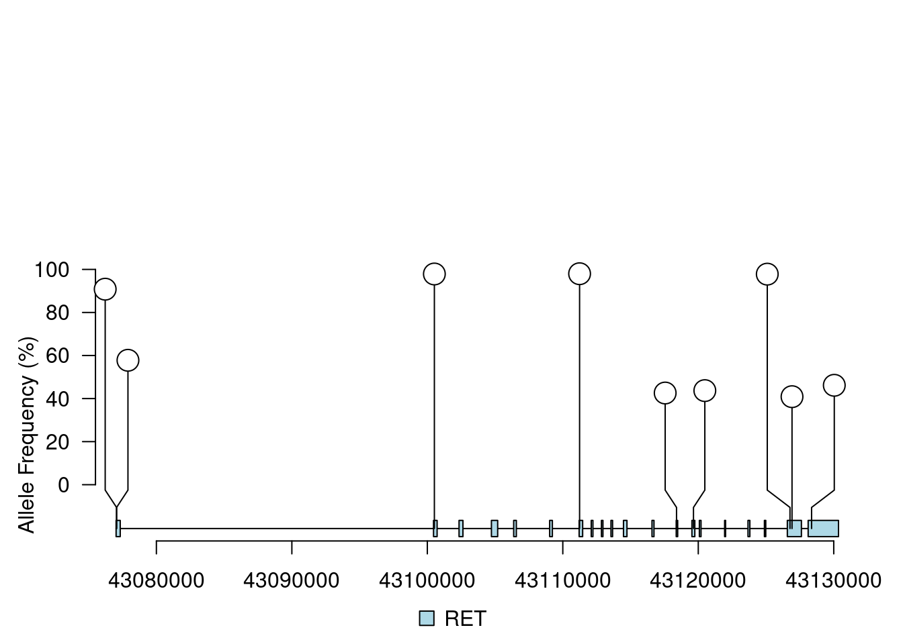
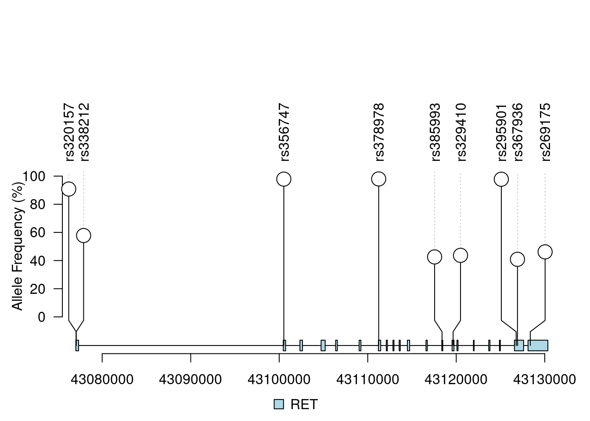
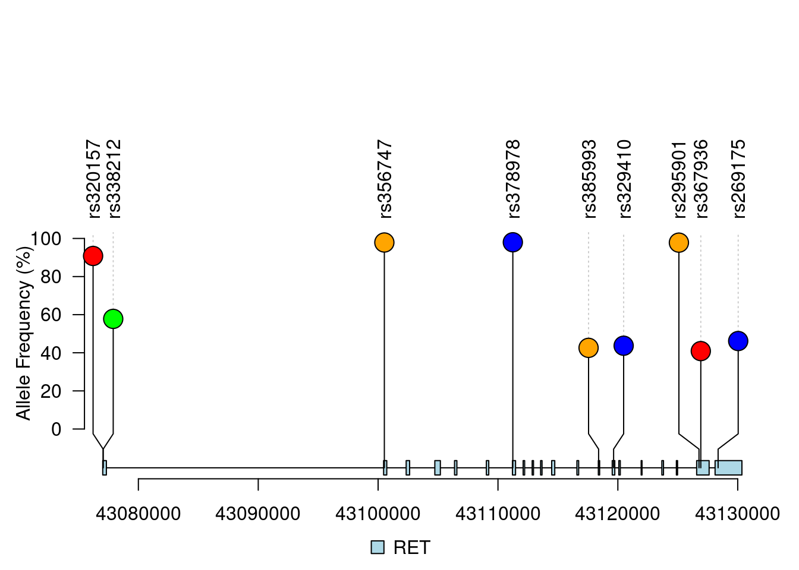

# Variant Visualization {#variant-visualization}

As described in chapter 1, the analysis and the resulting variants needs to be presented. To make this presentation more appealing, we can add some visual elements to the report. In this section, we will discuss a few options for visualizing the data.

Besides a graphical representation, the complete table with all variants and - importantly - the reason why there were selected should be included in the presentation.

**LollipopPlot**

This visualization can be helpful in cases where many of the top-variants are located within a single gene. The plot shows the position of the variant on the x-axis and a score on the y-axis. The score can be the *AF* value from the VCF file or any other score that was added through the annotation steps. Further data ('dimensions') can be added through changes to:

* The color of the lollipop (e.g. red for a high score, green for a low score)
* The size of the lollipop (e.g. the size of the lollipop is proportional to the score)
* The symbol of the lollipop (e.g. a star for a variant that is validated)
* A value displayed within each node
* Text labels attached to the nodes

There are multiple options for drawing these types of graphs but here we demonstrate the use of the `lolliplot` function from the `trackViewer` package in R, see the [online manual](https://bioconductor.org/packages/release/bioc/vignettes/trackViewer/inst/doc/lollipopPlot.html) for many examples on how to create this plot. This package is not installed by default in, so you have to install it yourself:

```{r, eval=FALSE}
BiocManager::install("trackViewer")
library(trackViewer)
```

It requires two data sources for our use case:

* The *sample* data which should be a `GRanges` object containing the **variants**
  - the example below shows how we use the output of `findOverlaps` to get the variants for a single gene
* The *feature* data containing the **gene** on which these variants are located, also in `GRanges` format
  - to get all exons for the selected gene we use our BED-data which is already in an `GRanges` object.

```{r, echo=FALSE, warning=FALSE, message=FALSE, eval=TRUE}
library(trackViewer)

load("data/lolli-sample.RData")
sample.gr <- RET
sample.gr$AF <- sample.gr$FREQ
sample.gr$FREQ <- NULL

load("data/lolli-features.RData")
features$fill <- NULL
features$height <- NULL
```

```{r, eval=FALSE}
# Preparing the data; first attach the gene names to the findOverlaps output
overlap_df$Gene <- names(bed_data)[overlap_df$subjectHits]

# Then, use this to get all variants from a single gene ('RET' in this example)
# Note that the vcf_Granges already containes the Allele frequency values (AF)
sample.gr <- vcf_GRanges[unlist(subset(overlap_df, Gene == "RET", select = queryHits))]

# The features are taken from the GRangesList object from chapter 3, assignment 3
features <- bed_data$RET
```

This basic example shows 9 variants for the RET gene, with the *AF* value as the score (scaled to a range of 0-100%). The plot shows the position of the variant on the x-axis and the allele-frequency on the y-axis.

**Note**: scores are a bit weird in this plot; for instance you cannot show values ranging from 0 to 1 (such as SIFT scores). Values between 1-10 are shown as stacked nodes (see the [Change the height of a lollipop plot](https://bioconductor.org/packages/release/bioc/vignettes/trackViewer/inst/doc/lollipopPlot.html#Change_the_height_of_a_lollipop_plot) section of the manual). A safe solution is to scale values from 0-100 as shown below. Alternatively, we can use the stacks to show the amount of splice variants at a single location (up to a maximum of 10).

```{r, echo=TRUE, eval=TRUE}
# Calculate AF as percentage and set as 'score' field
sample.gr$score <- sample.gr$AF * 100
head(sample.gr)

# RET gene exons
head(features)
```

```{r, eval=FALSE}
lolliplot(sample.gr, features, ylab = "Allele Frequency (%)")
```

```{r, echo=FALSE}
knitr::include_graphics("images/lolliplot_1.png")
```

Simple improvements are to increase the height and color of the exons (all exons share the same value):

```{r, echo=TRUE, eval=FALSE}
features$height <- 0.03
features$fill <- "lightblue"
head(features)
lolliplot(sample.gr, features, ylab = "Allele Frequency (%)")
```

```{r, echo=FALSE}

```

Adding labels to the variants, in this case some random dbsnp IDs but these could be any other value available:

```{r, echo=TRUE, eval=FALSE}
# Generate random dbsnp IDs
dbsnp_ids <- paste0("rs", sample(239283:532801, length(sample.gr)))

# Add names to the IRanges object within the GRanges
sample.gr <- setNames(sample.gr, dbsnp_ids)

lolliplot(sample.gr, features, ylab = "Allele Frequency (%)")
```

```{r, echo=FALSE}

```

Changing the color based on the *effect impact* from the `SnpEff` Galaxy tool

```{r, echo=TRUE, eval=FALSE}
effect <-       c("MODERATE", "LOW", "MODIFIER", "HIGH")
effect.color <- c("orange",   "blue","green",    "red")

# Randomly select an effect for each variant
sample.gr$effect <- effect[sample(1:4, length(sample.gr), replace = TRUE)]

# Given the effect, get the matching color
sample.gr$color <- effect.color[match(sample.gr$effect, effect)]

lolliplot(sample.gr, features, ylab = "Allele Frequency (%)")
```

```{r, echo=FALSE}

```

**Dandelion Plot**

If there are a lot of variants close together, an alternative can be the *dandelion plot* which is a variation of the lollipop plot where the variants are grouped together based on their position. It's available from the same library, see the [online manual](https://bioconductor.org/packages/release/bioc/vignettes/trackViewer/inst/doc/trackViewer.html#Dandelion_Plot) for more information.

## Galaxy Workflow

Now that we have completed our analysis steps we can create a **Galaxy workflow**. In this workflow we will combine all the tools that we have used in Galaxy (FastQ files --> SnpEff/SnpSift annotated output) so that when we receive new patient data in the future we can analyze that dataset with a single click!

There are many [online resources](https://galaxyproject.org/learn/advanced-workflow/) giving instructions and examples for creating Galaxy workflows, use these resources to create a workflow including all used analysis tools. Note that you can convert Galaxy histories into workflow(s), which saves a lot of time with configuring all the tools from that workfow.

Once you have a workflow, make sure it is shared with your project partner and create a screenshot of it for your report (try to fit all tools in a single image).

**Note**; this assignment has a very low priority and should be done once you are satisfied with all other parts of your work! At the bare minimum, open your last history (including SnpEff/SnpSift) and explore/ play with the `Extract Workflow` option.

## Comparative Genomics [OPTIONAL]

With the complete analysis nicely packaged into a single workflow, one thing that we can use it for is to do *comparative genomics*. This term contains many different types of comparisons and is described on Wikipedia as 

> *Comparative genomics is a field of biological research in which the genomic features of different organisms are compared.*

These features can be of many types and in our case they are the variants. A simple tool is available in Galaxy called *VCF-VCFintersect* that performs either *intersection* or *union* on two VCF datasets containing variant data. This tool compares two VCF files and retains either the shared variants (intersection) or all variants combined (union) as shown in the diagram below.

```{r, echo=FALSE}
knitr::include_graphics("images/intersect_union.png")
```

**Optional Assignment**

* Process another patient sample (use a new history) by running your complete workflow. 
    + Note that you have to filter the resulting SnpEff output (which contains the same data as the VCF file appended with annotation data) with the BED-data. Alternatively, you can stop after the LoFreq tool, download the VCF file, filter this using the BED-data and re-upload the filtered VCF file before continuing with SnpEff
* Calculate the following three statistics:
    + The number of variants unique to patient 1
    + The number of variants unique to patient 2
    + The number of variants found in both patients
* Create a VENN-diagram (like the image above) displaying these numbers.
