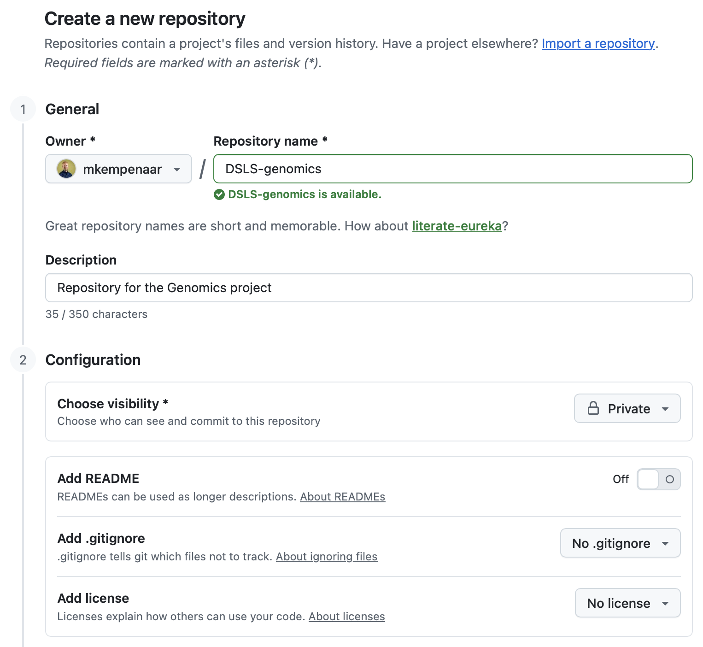
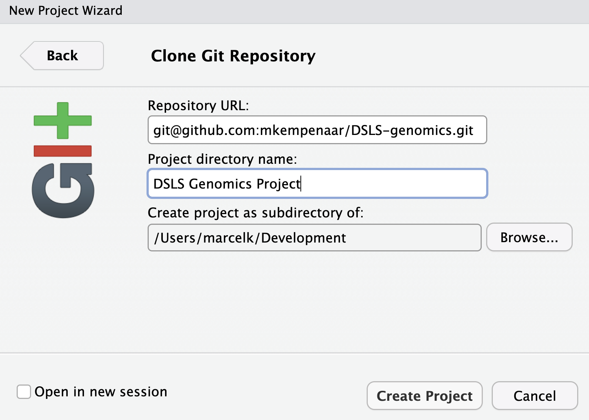
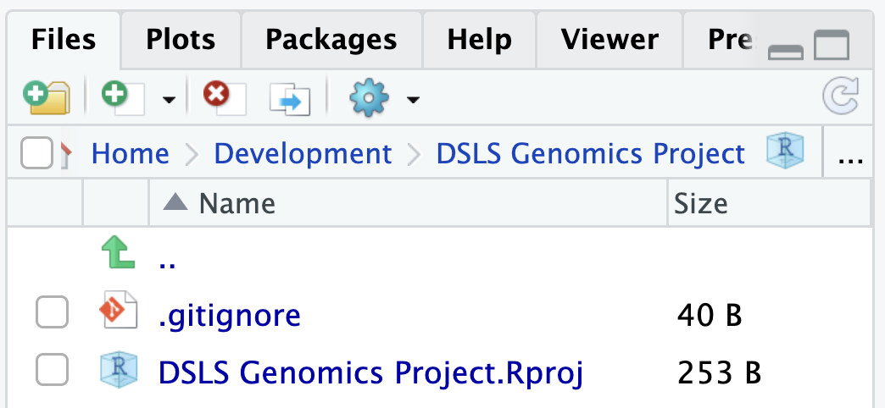
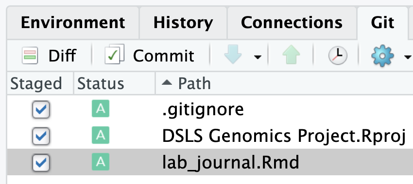
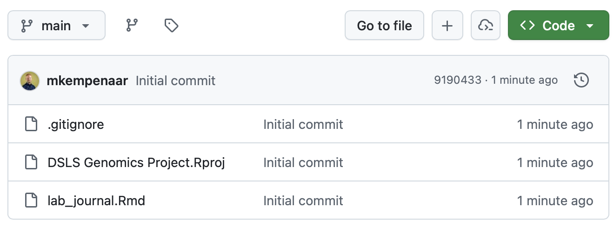

# Appendix A1 - Using Git in RStudio

Working together on a single project can be difficult without a proper method of sharing data between team members. This document describes setting up a Git *repository* for storing and sharing - in this case - a RMarkdown lab journal.

RStudio has an interface supporting common tasks for managing a repository and the following steps will guide you through this process. Note that for people to work together; only **one** repository has to be created!

**Steps**:

-   **Creating a Git repository**:
    -   There are multiple online Git hosting platforms. Globally GitHub is the most used one, but this requires the creation of an account. Repositories on GitHub can and are also used as a 'portfolio' to demonstrate your skills, so we advice to approach the use of it professionally. We also host our own local Git hosting platform in the form of GitLab, for which you can use your bioinf-network account.
        -   [GitHub](https://github.com)
        -   [GitLab](https://git.bioinf.nl)
    -   Once logged in, both platforms allow you to create a new repository.
    -   Make sure the repository is made **private**.

{width=70%}

-   **Authentication**:
    -   Before we can access the contents of the repository or add anything, we need to setup authentication:
        -   Add an authentication key to GitHub or GitLab, which is your SSH **public** key.
        -   Go to your Git profile and find a setting such as 'SSH and GPG keys' (GitHub).
        -   Copy the contents of your public key; often found in your `.ssh/` folder and named `id_ed25519.pub` (notice the `.pub` extension, do not touch/open the file *without* extension).
        - Note that if you do not yet have an SSH key, generate one by executing the `ssh-keygen` command in a terminal/console/PowerShell. Search for 'create SSH key' + the name of your operating system to get more details.
        -   Paste the public key in the field when adding a new SSH-key
-   **Cloning the repository**:
    -   To get a local copy of the repository so that you can add your (existing) RMarkdown document requires a **cloning** step. Luckily, we can do that from within RStudio by following these steps:
        -   In RStudio, click on `File` -\> `New Project`

        -   Then, select `Version Control` -\> `Git` and enter the repository URL. You can get the URL from the repository website. It should look like `git@github.com:<username>/repository`, for instance `git@github.com:mkempenaar/DSLS-genomics.git` with the example created.

        -   Select a location where to store the repository, for instance in your `Documents` folder\

{width=70%}

-   After cloning, RStudio will open the new project with the contents of the repository that contains at least two files:
  -   `.gitignore` can be used to ignore files that you don't want in your repository.
  -   an `.Rproj` file that can include settings for RStudio relevant to this project.
  -   Also new is the `Git` tab in the top-right panel in RStudio (by default) that you can use to interact (synchronize) with your repository.
  
{width=60%}

-   **Adding your RMarkdown lab journal**:
    -   To add your lab journal to the repository, create a new RMarkdown document or copy over your existing `.Rmd` file into the repository folder.
    -   Next, go to the `Git` tab and you will see the same files listed there with yellow question mark icons. This means that Git does not know these files yet (they're new).
    -   By clicking the 'Staged' check mark for the files you want to add (I suggest the `.gitignore`, the `.Rproj` file and your `.Rmd` lab journal) you 'prepare' those files for synchronizing.

{width=60%}

  -   Next, click the `Commit` button that will open an interface showing all staged files with their changes (in green (additions) and or red (deletions)).
    -   Type a *Commit message* (required) that explains the changes that you're adding. In this case 'Initial commit' is fine. For the future, try to be descriptive such as "Performed the mapping step and added a section including results to the lab journal".
    -   Click on the `Commit` button (will open a new popup that can be closed) followed by the `Push` button at the top; this will synchronize your changes with the remote repository.
    -   Go to the web interface for your repository, refresh if needed, and it should list the files that have been added or changed.

{width=70%}

## Git Usage

This concludes the initial setup of the repository and adding your lab journal. Next is a git-workflow that you could use during this and future projects.

Git can be easily be used to cooperate within the same 'code base', allowing editing the same files at the same time. However, this poses some risks as you need to make sure your work can be automatically *merged*. If multiple people edited the same lines (code or text), Git will force you to fix this *conflict* manually. What is and isn't a conflict is sometimes hard to predict, generally it's a good idea to discuss who makes what changes to prevent this type of issue.

When you want to work on your project, always make sure that you are *in-sync* with the remote repository. Do this by clicking on the `pull` button in the `Git` menu. This retrieves any changes you don't have already and tries to merge it locally with your own work. Git will warn you if you have open changes that conflict with this.

Try to - after a session/ lecture/ finishing a task - commit so that your latest changes are always on the repo. It's preferable to have multiple smaller commits compared to single very large commits. You can stack commits before running the `push` command (using the `push` button) or just push after each commit.

